# [Mr Robot.e — TryHackMe](https://tryhackme.com/room/mrrobot)

**Difficulty:** Medium

**Category:** Web exploitation, RCE, Linux, Privilege Escalation

## Overview

Mr Robot is a challenge where you start the engagement by enumerating a web application and ultimately escalate to root in order to retrieve three hidden keys.

---

## 1. Reconnaissance

### Port Scan

I started with an Nmap port scan using:

```bash
nmap -sV -sS -sC -p- -T5 -oN port_scan.txt <target>
```

*Full output in [port_scan.txt](./evidence/command_outputs/port_scan.txt).*

The scan identified three services:

- HTTP on port 80
- HTTPS on port 443
- SSH on port 22

I visited both web servers on ports 80 and 443. They were serving the same content, so I continued my web enumeration on port 80.

### Directory Enumeration

I used Gobuster with the `common.txt` wordlist to enumerate directories and files:

```bash
gobuster -u <target> -w /path/to/common.txt -x js,php,html,txt,bak,xml -rt 100
```

*Full output in [initial_dir_enum.txt](./evidence/command_outputs/initial_dir_enum.txt).*

There were a lot of responses, but only a few turned out to be useful. I also noticed many paths beginning with `wp-`, which later helped confirm that the application was running WordPress.

While Gobuster was running, I manually inspected some of the successful responses to understand the application better. The first interesting result was `/0`. It did not reveal much, but it redirected me to what appeared to be a blog page.

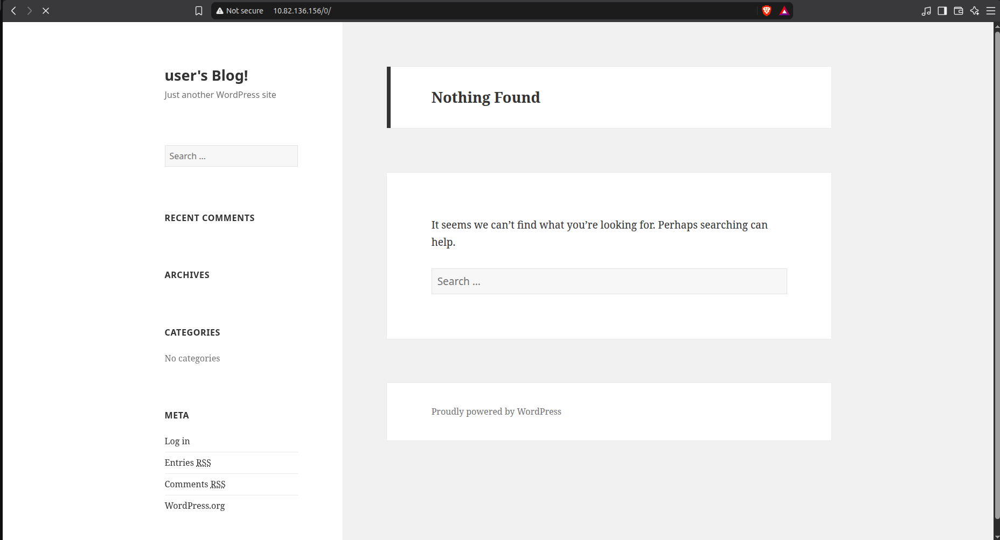

The second result I inspected was `/atom`. It contained the text `Just Another WordPress site`, confirming that the application was using WordPress. I did not yet know the exact version, but it was useful information.

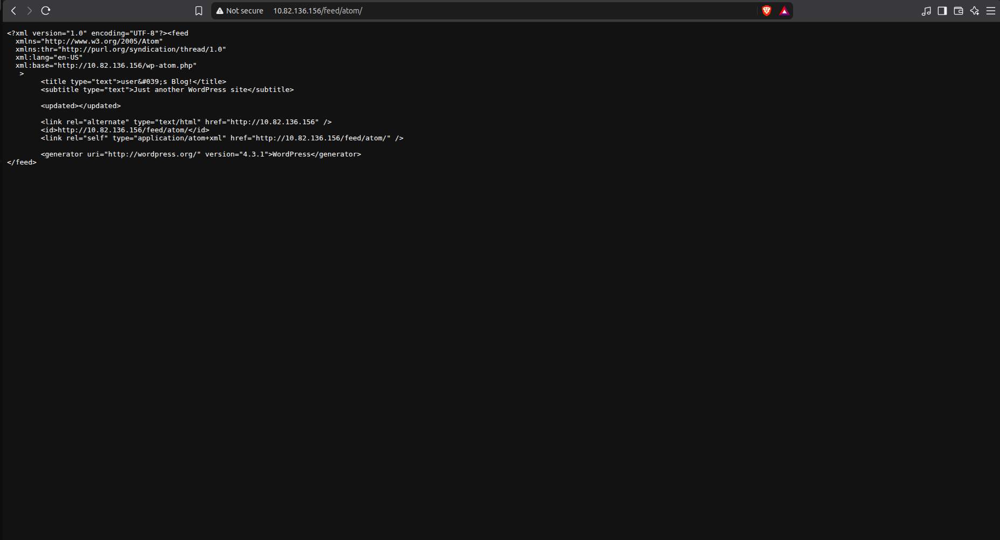

However, manually checking every successful response was inefficient, since many could simply be filler or automatically generated pages. I therefore let the enumeration finish and focused on the more interesting paths:

```text
/robots.txt
/admin
/license.txt
/readme.html
/login
/wp-admin
```

`/robots.txt` was particularly interesting. It contained two useful references:

- The first key
- A custom dictionary

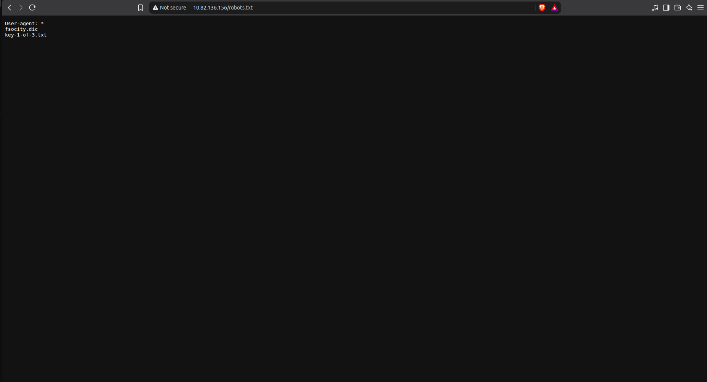

I tried accessing the referenced key directly with:

```text
/key-1-of-3.txt
```

This returned the first key.

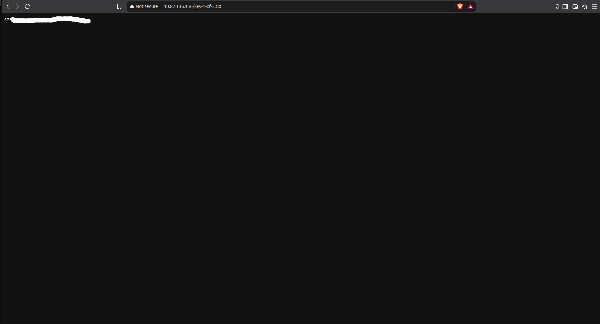

The second reference was `/fsocity.dic`, which was accessible directly. I downloaded it locally because I suspected it could be useful for password or credential attacks against the WordPress login.

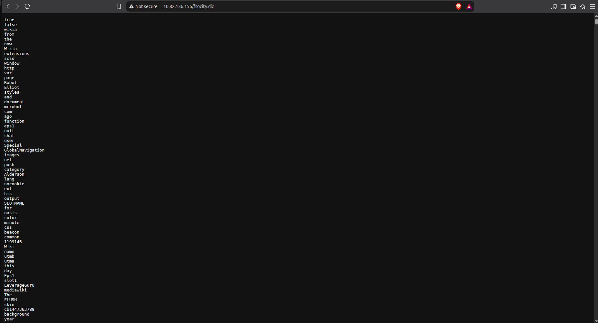

```bash
wget http://<target>/fsocity.dic
```

The `/admin` page redirected to `/admin/index.php`. I followed the redirect and inspected the page, but did not find anything useful for further enumeration or exploitation.

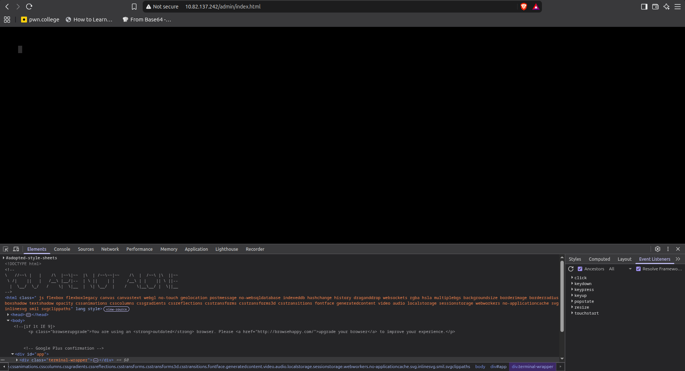

I then visited `/license.txt`, which contained another useful piece of information.

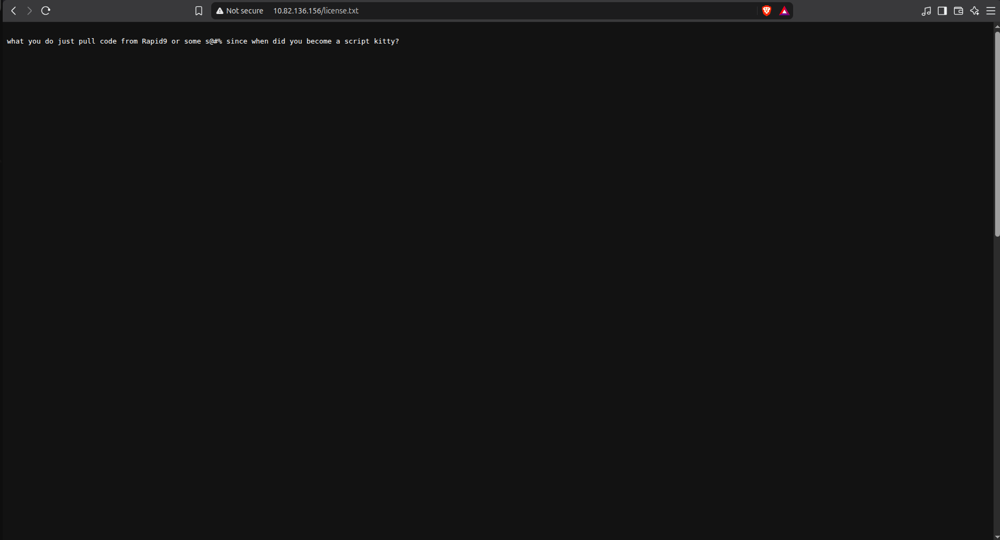

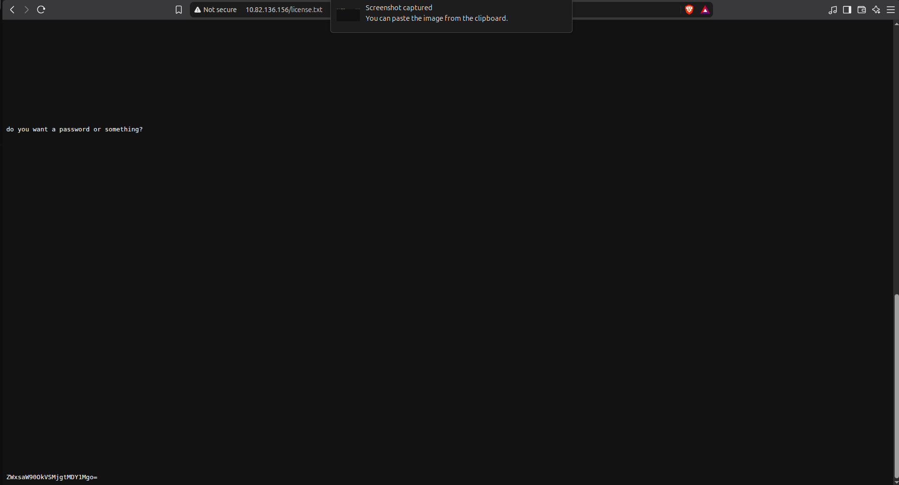

*Full output in [license.txt](./evidence/command_outputs/license.txt).*

At the end of the page was a string that looked encoded. The trailing `=` was a clue that it could be Base64, since `=` is commonly used as Base64 padding. I decoded it using CyberChef and obtained credentials in a `username:password` format.

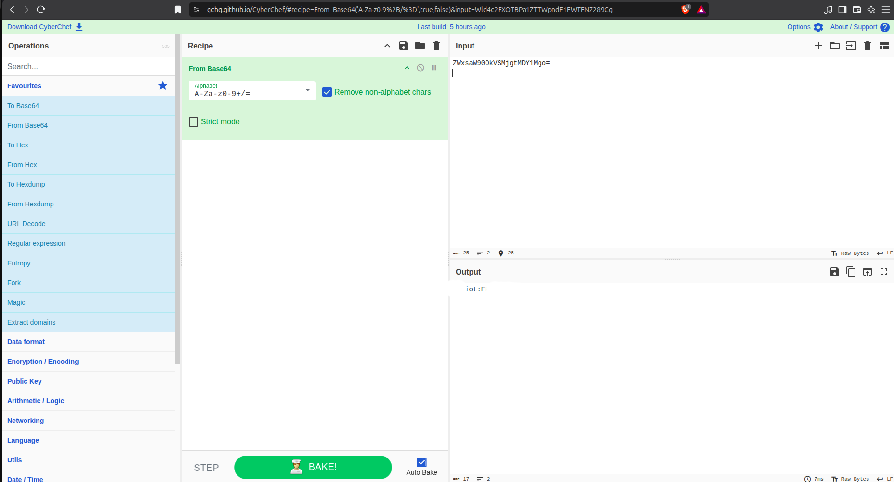

I also checked `/readme.html`. It did not contain anything useful, but it was a funny reference to the source material.

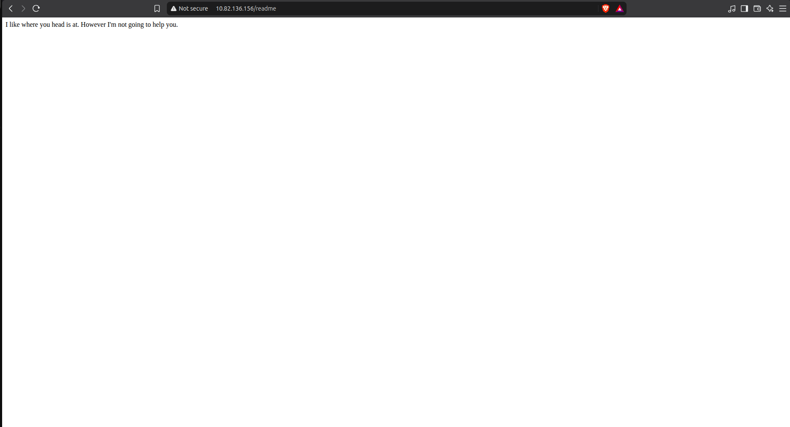

At this point, I had credentials worth testing against the WordPress login.

## 2. Initial Access

Visiting `/login` revealed a WordPress login page.

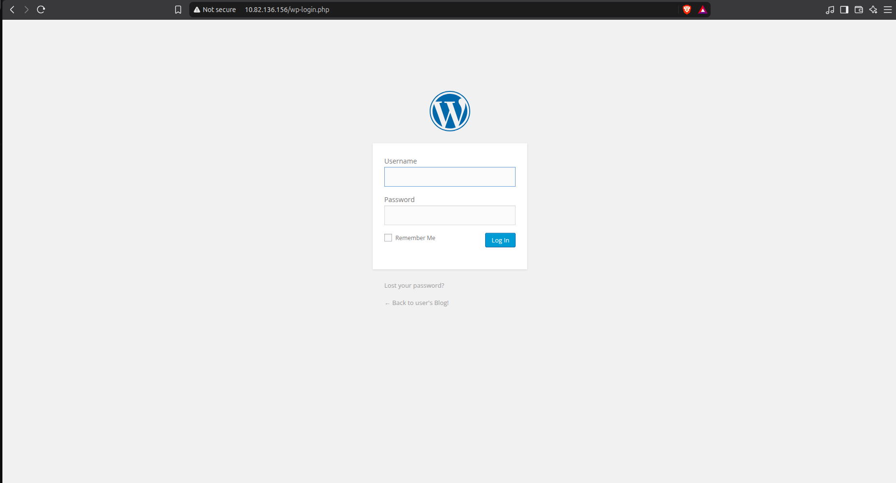

I tested the credentials recovered from `/license.txt`. They worked and provided WordPress administrator access.

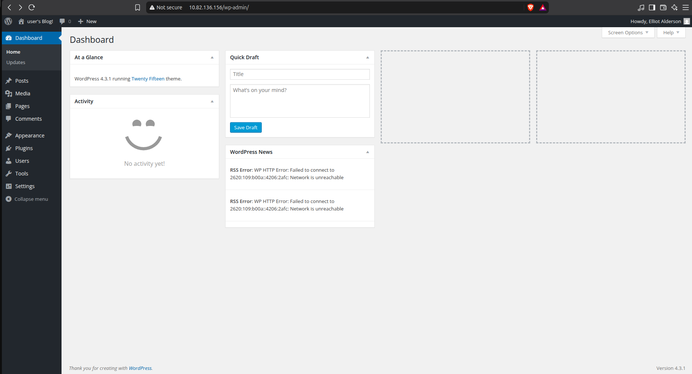

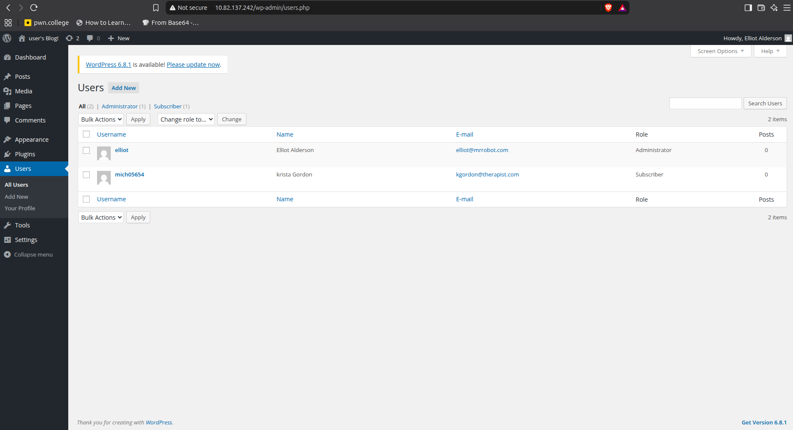

**Note:** Another possible approach is to use `fsocity.dic` to brute-force the WordPress login. I did not need to do this because enumeration had already provided working credentials.

I spent some time exploring the administration panel to determine what could be leveraged. Eventually, I found that the Theme File Editor was enabled.

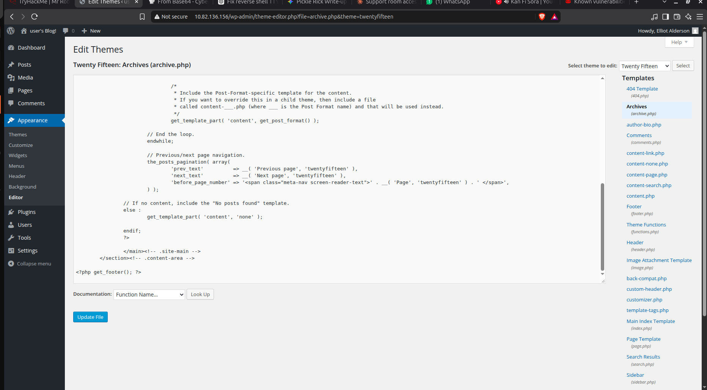

Because WordPress theme files contain executable PHP, an administrator with access to the editor can modify a PHP file and cause the web server to execute the modified code when the file is requested.

At this point this was still a hypothesis, so I first tested it with a simple, low-impact payload embedded in `archive.php`

```php
<?php
echo "PHP execution confirmed";
?>
```

I then requested `/wp-content/themes/twentyfifteen/archive.php`, which caused the server to execute the PHP code and return a page containing `PHP execution confirmed`.

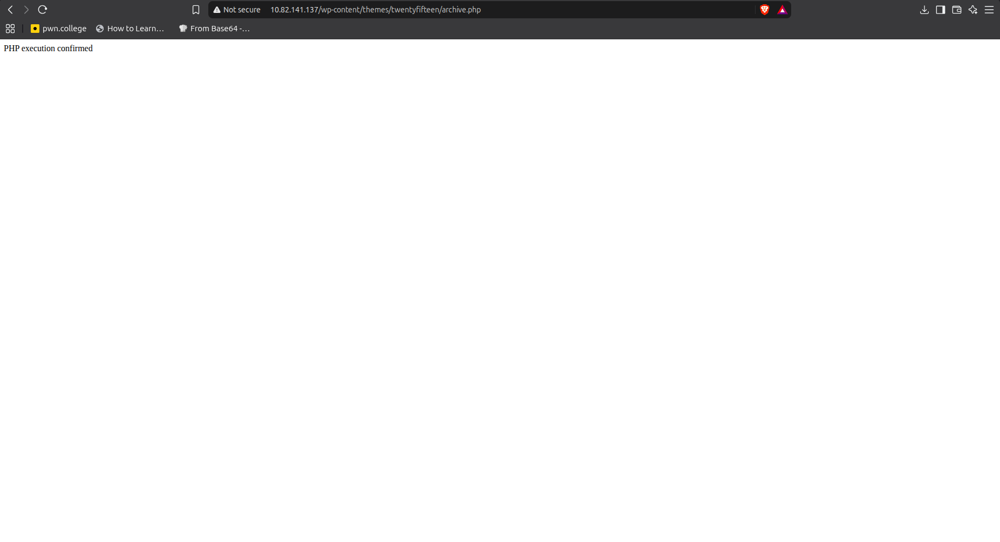

This confirmed that I could execute PHP code through the modified theme file. I then used this execution capability to obtain a shell on the server. 

I used a [PHP reverse-shell payload](https://github.com/pentestmonkey/php-reverse-shell/blob/master/php-reverse-shell.php). I started a listener on my machine, modified the payload's callback IP and port, and saved it in the theme file.

I then re-requested the same page which caused the server to execute the PHP code and connect back to my listener, giving me an initial shell on the machine.

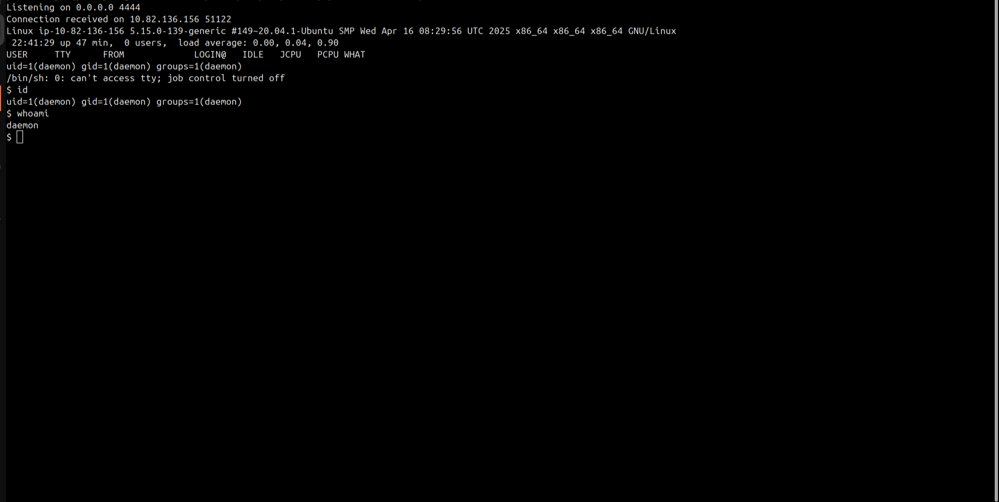

## 3. Filesystem Enumeration

With the initial shell, I enumerated the filesystem and started with `/home`. I found two user directories:

- `robot`
- `ubuntu`

The `ubuntu` directory did not contain anything useful. The `robot` directory contained:

- `key-2-of-3.txt`
- `password.raw-md5`

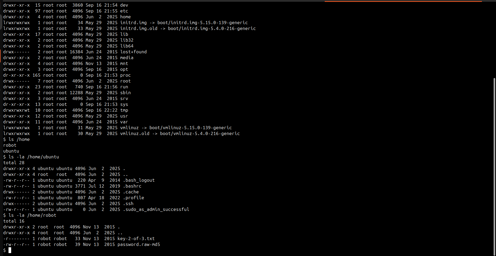

The permissions prevented my current account from reading `key-2-of-3.txt`, but `password.raw-md5` was readable.

*The hash is available in [robot_hash.txt](./evidence/command_outputs/robot_hash.txt).*

The filename and contents indicated that the value was an MD5 hash. I used John the Ripper with the `fsocity.dic` wordlist:

```bash
john --format=raw-md5 --wordlist=fsocity.dic robot_hash.txt
```

John recovered a candidate password, but when I tried to use it for authentication, it failed.

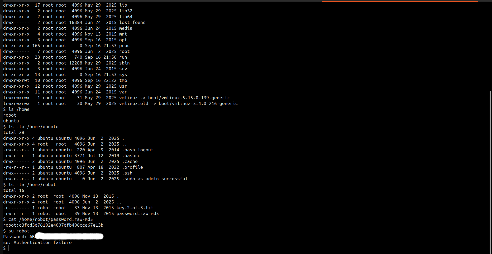

I then submitted the hash to [Hashes.com](https://hashes.com/en/decrypt/hash). It returned the same password in lowercase. When I tried the lowercase version, authentication succeeded and I obtained access as `robot`.

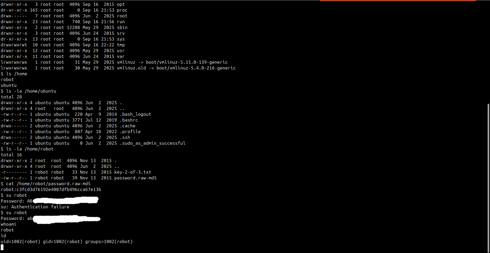

I could then retrieve the second key:

```bash
cat /home/robot/key-2-of-3.txt
```

## 4. Privilege Escalation

I first checked whether `robot` had any `sudo` privileges, but the account was not authorized to run commands through `sudo`.

I therefore enumerated SUID binaries:

```bash
find / -perm -4000 -type f 2>/dev/null
```

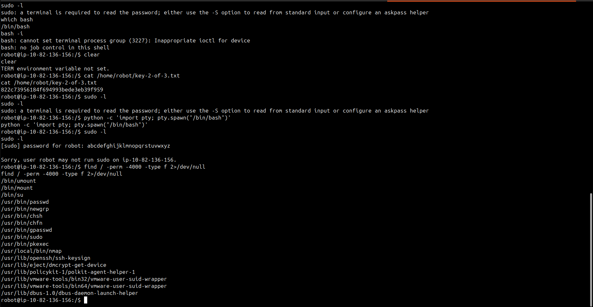

The interesting result was `nmap`.

The Nmap binary had the SUID bit set and was owned by `root`. This meant that when it was executed, its effective privileges were root's privileges. The installed version of Nmap also provided an interactive mode capable of executing system commands.

I launched Nmap's interactive mode and used it to spawn a Bash shell. Because the Nmap process was running with effective root privileges, the resulting shell had root access.

```bash
bash -i
```

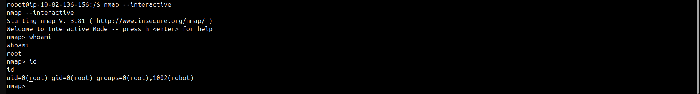

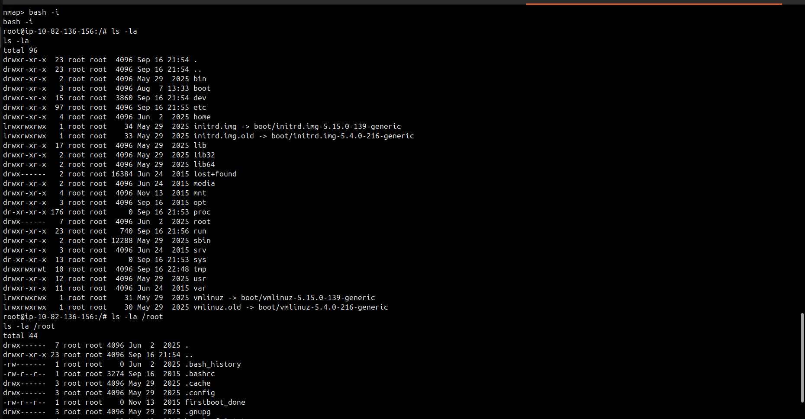

I could then retrieve the third key from `/root/key-3-of-3.txt`, completing the challenge.

## Attack Chain

```text
Reconnaissance
    ↓
Port & Service Enumeration
    ↓
Web / Directory Enumeration
    ↓
Information Disclosure
    ↓
WordPress Credential Discovery
    ↓
WordPress Administrator Access
    ↓
PHP File Modification
    ↓
Remote Code Execution
    ↓
Reverse Shell
    ↓
Credential / Hash Discovery
    ↓
Password Cracking
    ↓
robot Account Access
    ↓
SUID Enumeration
    ↓
Nmap SUID Exploitation
    ↓
Root Access
```

## Key Takeaways

There were several things I could have done better during this engagement:

- **Don't stop enumeration once an obvious attack path appears.** I found valid WordPress credentials relatively early, but additional enumeration could have provided more context about the application.
- **Fingerprint software versions.** I identified WordPress but did not initially determine its exact version or research the attack surface associated with that version.
- **Validate recovered credentials carefully.** John returned a candidate password, but authentication failed until I tested the lowercase form returned by another source.
- **Check SUID binaries after obtaining a low-privileged shell.** The SUID `nmap` binary ultimately provided the path to root.
- **Document dead ends.** The failed authentication attempt and the decision not to brute-force the WordPress login were both part of the actual methodology.

The main lesson for me was that enumeration does not stop after finding one useful result. Each discovery should lead to another question: *What else does this tell me about the target, and what can I verify from it?*

## Flags

Flags obtained during the challenge have been redacted from this write-up.

> TryHackMe flags and sensitive challenge credentials are intentionally omitted.
